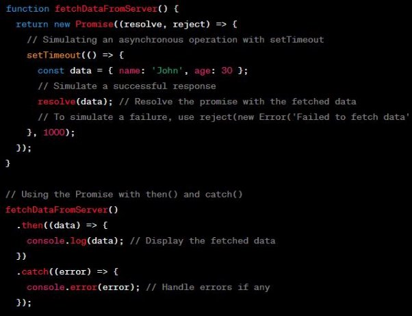

**Q-1 What is virtual DOM in React JS? How it works?**

In the context of React JS, the term "virtual dome" is commonly associated with the virtual DOM (Document Object Model). The virtual DOM is a concept used in React to efficiently update and render user interfaces.\*\*

Here's how it works:\*\*

- React maintains a virtual representation of the DOM, known as the virtual DOM. It's a lightweight copy of the actual DOM.\*\*
- Whenever there is a change in the state or props of a React component, React creates a new virtual DOM representation of the updated component.\*\*
- React then compares the new virtual DOM with the previous virtual DOM using a process called "**diffing**." It analyzes the differences between the two representations to determine the minimal number of changes needed to update the actual DOM.\*\*
- After identifying the necessary changes, React updates only the affected parts of the real DOM, minimizing the number of actual manipulations required\*\*

**Q-2 How React Works?**

React is a JavaScript library used for building user interfaces, specifically for building single-page applications (SPAs). Here's a high-level overview of how React works:

- **Component-based Structure**: React applications are built using components. A component is a self-contained, reusable piece of code that encapsulates HTML, CSS, and JavaScript logic. Components can be composed together to create complex UIs.
- **Virtual DOM:** React uses a virtual DOM to efficiently update and render UI components. The virtual DOM is a lightweight copy of the actual DOM (the HTML representation of a web page). React keeps a virtual representation of the UI in memory and updates it based on changes to the application state.
- **Declarative Syntax**: React uses a declarative syntax, which means you describe how your UI should look based on the current application state, and React takes care of updating the UI to match that state. This allows you to write simpler and more predictable code.
- **State Management**: React provides a way to manage application state using a concept called "state." State represents the dynamic data within a component. When the state changes, React automatically updates the virtual DOM and re-renders the affected components.
- **Reconciliation**: When the application state changes, React performs a process called "reconciliation" to determine the minimal number of changes needed to update the actual DOM. React compares the previous virtual DOM with the new one and applies only the necessary changes to the real DOM, improving performance
- **One-way Data Flow**: React follows a one-way data flow, also known as uni-directional data flow. Data flows from parent components to child components through props (properties), and if a child component needs to communicate with its parent, it can do so through callbacks passed as props.

**Q-3 How does Reducer works in Redux toolkit?**

In Redux Toolkit, the process of creating and working with reducers is simplified through the use of the createSlice and createReducer functions. These functions provide a streamlined way to define reducers and actions in Redux.

Here's how reducers work in Redux Toolkit:

- **Creating a Slice**: In Redux Toolkit, you typically start by creating a "slice" using the createSlice function. A slice represents a portion of your application state along with the associated reducer and actions.
- **Defining Initial State and Reducers**: With createSlice, you define the initial state for the slice and specify a set of reducer functions. The reducers are defined using an object where the keys are action types, and the values are functions that handle the state updates for those actions.
- **Automatic Action Creation**: When you define a slice using createSlice, Redux Toolkit automatically generates action creators for each reducer function defined in the slice. These action creators can be used to dispatch actions that trigger state updates.
- **Handling State Updates**: The reducer functions specified in the slice define how the state should be updated in response to dispatched actions. The state updates are typically implemented using immutable patterns, such as the immer library, which simplifies the process of creating new state objects with the necessary modifications.
- **Exporting Reducer and Actions**: The createSlice function returns an object that includes the generated reducer and the automatically created action creators. You can export these from your slice module and use them in other parts of your application.
- **Combining Reducers**: If your application has multiple slices with their own reducers, you can use the combineReducers function provided by Redux Toolkit to combine them into a single root reducer that can be used with the Redux store.

**Q-4 How does action is dispatched in useReducer hook in Redux?**

The useReducer hook in Redux provides a simplified way to manage state and dispatch actions within a React component. While useReducer is not specifically part of Redux (it's a built-in React hook), it can be used in combination with Redux to handle state updates.

Here's how actions are dispatched using the useReducer hook in conjunction with Redux:

- **Importing Dependencies**: Begin by importing the necessary dependencies in your React component. You'll need to import useReducer from the React library and any actions or action creators generated by Redux.
- **Defining the Initial State**: Specify the initial state for your component. This could be a simple JavaScript object or a more complex data structure, depending on your needs.
- **Creating the Reducer Function**: Define a reducer function that specifies how the state should be updated based on dispatched actions. This function follows the standard reducer pattern, taking in the current state and an action as parameters, and returning the updated state.
- **Initializing the State and Dispatch**: Use the useReducer hook to initialize the state and dispatch function within your component. The useReducer hook takes the reducer function and the initial state as arguments and returns an array with the current state and the dispatch function.

const [state, dispatch] = useReducer(reducer, initialState);

- **Dispatching Actions**: To dispatch actions, you can call the dispatch function returned by useReducer. Pass in an action object that typically includes a type property to specify the action type and any additional payload data.

dispatch({ type: 'ACTION_TYPE', payload: data });

The dispatched action will be processed by the reducer function, and the state will be updated accordingly.

- **Handling Actions with Redux Toolkit**: If you are using Redux Toolkit, you can define actions and reducers using the createSlice function or other Redux Toolkit utilities. The generated actions and action creators can be imported and used within your component to dispatch actions.

import { useDispatch } from 'react-redux';

import { increment, decrement } from './counterSlice'; const dispatch = useDispatch();

// Dispatching actions using Redux Toolkit action creators dispatch(increment());

dispatch(decrement());

**Q-5 What is JSON?**

JSON stands for JavaScript Object Notation. It is a lightweight data interchange format that is easy for humans to read and write and easy for machines to parse and generate. JSON is often used for transmitting data between a server and a web application, as an alternative to XML.

JSON is based on a subset of the JavaScript programming language, although it is language- independent and can be used with various programming languages. It provides a simple and flexible way to represent structured data, such as objects, arrays, strings, numbers, booleans, and null values.

- **Readability**: JSON is designed to be human-readable and easy to understand. Its syntax is simpler and more concise compared to other formats like XML, making it easier for developers to work with and troubleshoot.
- **Size**: JSON typically has a smaller file size compared to other formats like XML due to its minimalistic syntax. This can result in faster data transmission and reduced storage requirements.
- **Parsing**: JSON parsing is generally faster and more efficient than parsing other formats. Since JSON is based on JavaScript syntax, most modern programming languages have built-in support for parsing JSON, making it straightforward to convert JSON data into native data structures.
- **Language Independence**: While JSON is based on JavaScript, it is not limited to JavaScript applications. JSON can be used with a wide range of programming languages and platforms since it utilizes a universally understood data structure.
- **Data Types**: JSON supports a limited set of data types, including objects, arrays, strings, numbers, booleans, and null values. This simplicity makes it easier to work with, but it may lack some of the specialized data types or structures available in other formats.
- **Schema Support:** JSON does not have inherent schema support, meaning there is no built-in mechanism to enforce data validation or define the structure of the data. However, JSON Schema is a separate specification that allows developers to define and validate the structure and integrity of JSON documents.
- **Ecosystem:** JSON has a wide adoption and a robust ecosystem of libraries and tools available for parsing, generating, manipulating, and validating JSON data across various programming languages

**Q-6 What is API ? Why to use API?**

API stands for Application Programming Interface. It is a set of rules and protocols that allows different software applications to communicate and interact with each other. APIs define the methods and data formats that applications can use to request or exchange information.

Here are a few reasons why APIs are commonly used:

- **Integration and Interoperability:** APIs enable different software systems, services, or platforms to integrate and work together. Applications can use APIs to access the functionality or data of other applications, services, or devices, allowing for seamless communication and interoperability between systems.
- **Modularity and Reusability**: APIs promote modularity by encapsulating specific functionality or services in a well-defined interface. This allows developers to build applications by leveraging existing APIs instead of reinventing the wheel. By using APIs, developers can save time and effort, improve efficiency, and focus on specific areas of their application development.
- **Exposing Data and Services**: APIs are often used to expose data or services provided by a software system. This allows other applications to access and utilize the exposed data or functionality. For example, social media platforms provide APIs that allow developers to access user data or post content on behalf of users.
- **Developer Ecosystem and Innovation**: APIs play a crucial role in fostering a developer ecosystem and promoting innovation. By providing APIs, companies or organizations encourage developers to build on top of their platforms, extend their services, and create new applications or integrations. APIs enable third-party developers to leverage existing systems and data to create new and innovative solutions.
- **Mobile and Web Development**: APIs are extensively used in mobile and web development to fetch data from server-side applications or to interact with external services. For example, mobile apps often use APIs to retrieve data from a remote server, authenticate users, or perform actions such as sending push notifications.
- **Versioning and Compatibility**: APIs can support versioning to manage changes and ensure backward compatibility. By maintaining different versions of an API, developers can make updates and introduce new features without breaking existing integrations. This allows for a smooth transition and allows consumers of the API to adopt changes at their own pace.
- **Security and Control**: APIs provide a controlled way to expose functionality or data while maintaining security. APIs often require authentication and authorization mechanisms, ensuring that only authorized users or applications can access protected resources. API

usage can be monitored, controlled, and secured through rate limiting, throttling, and other security measures.

**Q-7 What are the key differences between HTML, CSS, and JavaScript?**

HTML, CSS, and JavaScript are the three fundamental technologies used in web development. Here are the key differences between them:

**HTML (HyperText Markup Language):**

- Purpose: HTML is a markup language used for structuring and presenting content on the web.
- Role: It defines the structure and semantic meaning of web content, including text, images, links, headings, paragraphs, lists, tables, and more.
- Syntax: HTML uses tags to enclose elements and attributes to provide additional information about those elements.
- Example: <h1>This is a Heading</h1>

**CSS (Cascading Style Sheets):**

- Purpose: CSS is a styling language used to define the visual presentation of HTML documents.
- Role: It controls the layout, colors, fonts, sizes, and other visual aspects of web content.
- Syntax: CSS uses selectors to target HTML elements and declarations to specify the styles applied to those elements.
- Example: h1 { color: blue; font-size: 24px; }

**JavaScript:**

- Purpose: JavaScript is a programming language used to add interactivity and dynamic behavior to web pages.
- Role: It enables the creation of interactive features, such as user interactions, form validation, data manipulation, animations, and more.
- Syntax: JavaScript provides a wide range of functionality, including variables, data types, control flow statements (if/else, loops), functions, objects, and more.

**Q-8 What is the box model in CSS, and how does it work?**

The box model is a fundamental concept in CSS that defines how elements are rendered and structured on a web page. It describes the properties and behavior of the rectangular boxes that surround HTML elements.

The box model consists of four layers:

1. **Content**: The innermost layer, which contains the actual content of the element, such as text, images, or other HTML elements.
1. **Padding**: The space around the content, represented by the padding area. It provides spacing between the content and the border. Padding can be set individually for each side (top, right, bottom, left).
1. **Border**: The border surrounds the padding and content and creates a visible boundary. It is represented by the border area and can be styled with different colors, widths, and styles.
1. **Margin**: The outermost layer, represented by the margin area. It creates space between the element and adjacent elements or the containing parent element. Margins can be set individually for each side.

**Q-9 Can you explain the concept of responsive web design and how it is achieved?**

Responsive web design is an approach to building websites that aim to provide an optimal viewing and user experience across various devices and screen sizes. It involves designing and developing websites to automatically adjust and adapt their layout, content, and functionality based on the device and viewport size.

The primary goal of responsive web design is to ensure that users can access and navigate a website easily, regardless of whether they are using a desktop computer, laptop, tablet, or smartphone. Responsive design achieves this by dynamically reorganizing and resizing elements on the page to fit the available screen space.

Here are some key principles and techniques used in responsive web design:

- **Fluid Grids**: A responsive design uses a fluid grid system that allows the layout to adapt to different screen sizes. Instead of specifying fixed widths for elements, the grid is defined in relative units (e.g., percentages) so that elements can scale proportionally.
- **Flexible Images and Media**: Images and media are sized using relative units or through CSS techniques like max-width: 100% to prevent them from overflowing or becoming too small on smaller screens. This ensures that images scale appropriately while maintaining their aspect ratio.
- **Media Queries**: Media queries are CSS rules that allow different styles to be applied based on the characteristics of the device or viewport, such as screen width, height, and orientation. Media queries are used to define breakpoints, where specific styles are applied to accommodate different screen sizes.
- **Mobile-First Approach**: The mobile-first approach involves designing and developing websites starting from the smallest screen sizes and then progressively enhancing the layout and features for larger screens. This ensures that the core content and functionality are optimized for mobile devices and then expanded for desktop and other larger screens.
- **Responsive Typography**: Responsive design includes typography that adjusts based on screen size and readability. Font sizes, line heights, and spacing can be adjusted using relative units or media queries to ensure readability on different devices.
- **Navigation and User Experience**: Responsive design considers the navigation and user experience on various devices. It may involve using collapsible menus, touch-friendly controls, or optimizing the order and visibility of content to improve usability on smaller screens.

By employing these techniques and principles, responsive web design enables a website to adapt and provide an optimal experience across a wide range of devices. It ensures that users can access and interact with the content effectively, regardless of the device they are using.

**Q-10 How do you optimize website performance and loading speed?**

Optimizing website performance and loading speed is crucial for providing a smooth and efficient user experience. Here are some key approaches and techniques to improve website performance:

- **Minimize File Sizes**: Reduce the size of HTML, CSS, and JavaScript files by minimizing whitespace, removing comments, and utilizing compression techniques like GZIP. Additionally, optimize images by compressing them without compromising visual quality.
- **Enable Caching**: Implement browser caching to store static resources, such as CSS, JavaScript, and images, on the user's device. This allows subsequent page visits to load faster as the browser can retrieve the cached files instead of making new requests to the server.
- **Lazy Loading**: Employ lazy loading for images, videos, and other non-critical resources. Lazy loading delays the loading of off-screen elements until they are about to come into view, reducing the initial load time of the page.
- **Minimize HTTP Requests**: Reduce the number of HTTP requests by combining and minifying CSS and JavaScript files. Consider using CSS sprites for combining multiple images into a single file and utilizing font icons instead of multiple image icons.
- **Optimize Rendering**: Optimize the rendering process by placing critical CSS inline or in the head section to enable the browser to render content faster. Avoid render-blocking JavaScript and utilize asynchronous loading techniques where possible.
- **Content Delivery Network (CDN)**: Use a CDN to distribute your website's static assets across multiple servers worldwide. This helps deliver content to users from a server closer to their geographical location, reducing latency and improving loading times.
- **Responsive Images**: Serve appropriately sized images based on the device's screen size. Use the srcset attribute or responsive image techniques to deliver different image versions based on the viewport.
- **Minimize Redirects**: Reduce the number of redirects as they add additional round trips and increase loading times. Update or remove unnecessary redirects to ensure a more direct path to the desired content.
- **Optimize Database Queries:** Analyze and optimize database queries to ensure efficient data retrieval. Use caching techniques and employ indexing where applicable to speed up database operations.
- **Regular Performance Monitoring**: Continuously monitor your website's performance using tools like Google PageSpeed Insights, WebPageTest, or Lighthouse. Identify performance bottlenecks and make data-driven optimizations based on the results.

Remember that performance optimization is an ongoing process. Regularly review and optimize your code, assets, and server configurations to maintain optimal website performance.

**Q-11 What are the benefits and drawbacks of using CSS preprocessors like Sass or Less?**

CSS preprocessors like Sass (Syntactically Awesome Style Sheets) and Less (Leaner Style Sheets) provide additional functionality and features that extend the capabilities of regular CSS. Here are the benefits and drawbacks of using CSS preprocessors:

**Benefits of CSS preprocessors:**

- **Variables and Mixins**: Preprocessors allow the use of variables and mixins, which improve code reusability and maintainability. Variables enable the centralization of common values, making it easier to update them throughout the stylesheet. Mixins allow the creation of reusable blocks of CSS code, reducing duplication and enhancing productivity.
- **Nesting**: CSS preprocessors support nesting of selectors, which can make the code more readable and organized. Nesting eliminates the need to repeat parent selectors, making it easier to manage styles for nested elements.
- **Modularity**: CSS preprocessors enable modular and component-based styling, which enhances code organization and reusability. Styles can be organized into separate files or modules and then combined and compiled into a single CSS file for production.
- **Functions and Operators**: Preprocessors provide functions and operators that expand the capabilities of regular CSS. Functions allow complex calculations, color manipulation, and string manipulation within the stylesheet. Operators enable mathematical operations, making it easier to define dynamic styles.
- **Code Reusability**: With the ability to create mixins, functions, and variables, CSS preprocessors promote code reusability, reducing redundancy and improving code maintainability. Styles can be defined once and used across multiple elements or projects, resulting in cleaner and more efficient code.

**Drawbacks of CSS preprocessors:**

- **Learning Curve**: CSS preprocessors have their own syntax and features that need to be learned. Developers need to invest time in understanding the specific syntax and concepts of the chosen preprocessor.
- **Build Step**: CSS preprocessors require a build step to compile the preprocessed code into regular CSS that can be understood by browsers. This additional step adds complexity to the development process and requires setting up a build system or task runner.
- **Tool Dependencies**: Working with preprocessors often requires additional tools or plugins to integrate them into the development workflow. This can introduce dependencies on build tools like Node.js or task runners like Gulp or Webpack.
- **Overcomplication**: The flexibility and power of CSS preprocessors can lead to overcomplicated stylesheets if not used carefully. Developers should ensure that code remains readable, maintainable, and follows best practices to avoid unnecessary complexity.
- **Performance Impact**: The compilation step and larger file sizes due to additional features can slightly impact performance. However, this impact is often negligible and can be mitigated by optimizing the build process and minifying the final CSS output.

When used properly, CSS preprocessors offer significant benefits in terms of code organization, reusability, and maintainability. The drawbacks can be overcome with proper tooling and development practices. Ultimately, the decision to use a CSS preprocessor depends on the project's requirements, team preferences, and the expected long-term benefits of using additional features and improved development workflows.

**Q-12 Can you explain the concept of event delegation in JavaScript?**

Event delegation is a concept in JavaScript that allows you to handle events on multiple elements by attaching a single event listener to a common parent element, rather than attaching individual event listeners to each child element. When an event occurs on a child element, the event bubbles up to the parent element, and the event listener on the parent handles the event.

Here's how event delegation works:

- **Attach Event Listener to Parent Element**: Instead of attaching event listeners to each child element individually, you attach a single event listener to a parent element that contains all the child elements you want to target.
- **Event Bubbling**: When an event occurs on a child element, such as a click event, it triggers the event on the child element itself. Then, the event bubbles up through the DOM hierarchy, triggering the same event on each parent element up to the root element.
- **Event Target Identification**: Within the event listener attached to the parent element, you can access the event.target property to identify the actual element on which the event occurred. This allows you to determine which specific child element triggered the event.
- **Conditional Handling**: Based on the event.target, you can conditionally handle the event and perform the desired action. You can use conditional statements or element selectors to identify the target element and execute different code blocks accordingly.

**Benefits of event delegation:**

- **Performance**: By attaching a single event listener to a parent element, you reduce the number of event listeners in your code, which can improve performance, especially when dealing with a large number of child elements.
- **Dynamically Added Elements**: Event delegation is useful for handling events on dynamically added or removed elements. Since the event listener is attached to a parent element that remains constant, it can automatically handle events on newly added child elements without the need to attach new event listeners.
- **Simplified Code**: Event delegation allows you to write less code by avoiding the need to attach individual event listeners to each child element. This can simplify code maintenance and reduce the chances of memory leaks caused by orphaned event listeners.

It's important to note that not all events bubble up the DOM tree by default (e.g., focus and blur events). However, most user-triggered events, such as click, mouseover, and keydown, do bubble up and can be effectively handled using event delegation.

Event delegation is a powerful technique that leverages the event bubbling mechanism in JavaScript to handle events efficiently and provide flexibility when working with dynamically generated or large numbers of elements.

**Q-13 How would you approach making a web page accessible for users with disabilities?**

Making a web page accessible for users with disabilities is an essential aspect of web development. Here are some key approaches to ensure accessibility:

1. **Semantic HTML**: Use semantic HTML elements appropriately to provide meaningful structure and convey the purpose and relationships of the content. Properly use headings, lists, paragraphs, and other semantic elements to enhance the accessibility of the page.
1. **Keyboard Accessibility**: Ensure that all functionality and interactive elements on the page can be accessed and operated using the keyboard alone. This includes proper focus management, keyboard navigation, and the ability to activate buttons, links, and form elements with the keyboard.
1. **Alternative Text for Images**: Provide descriptive and concise alternative text (alt text) for images using the alt attribute. Alt text should convey the content and purpose of the image for users who cannot see the visual content.
1. **Captions and Transcripts**: Provide captions or transcripts for multimedia content such as videos or audio files. This enables users who are deaf or hard of hearing to access the information presented in the media.
1. **Color Contrast**: Ensure sufficient color contrast between the foreground text and background to make content readable for users with visual impairments. Use tools or guidelines to check and meet the recommended contrast ratios.
1. **Clear and Consistent Navigation**: Design a clear and consistent navigation structure to help users easily understand and navigate the website. Use descriptive link texts and headings to provide context and orientation.
1. **Form Accessibility**: Make sure form elements are properly labeled and provide clear instructions and validation messages. Use appropriate input types, provide accessible error messages, and use ARIA attributes when necessary.
1. **ARIA (Accessible Rich Internet Applications):** Utilize ARIA attributes and roles to enhance the accessibility of dynamic and interactive elements. ARIA can help convey additional information to assistive technologies and improve the user experience for individuals with disabilities.
1. **Testing and Assistive Technology**: Test the accessibility of your web page using automated tools, manual testing, and assistive technologies such as screen readers. Evaluate the usability and compatibility with different assistive technologies to ensure a seamless experience for users with disabilities.
1. **Stay Informed**: Stay updated with web accessibility guidelines and standards, such as the Web Content Accessibility Guidelines (WCAG) published by the W3C. WCAG provides detailed recommendations and techniques for making web content accessible.

It's important to integrate accessibility practices throughout the entire web development process, from design to implementation and testing. By prioritizing accessibility, you can ensure that your web page is inclusive and usable for all users, regardless of their abilities or disabilities.

**Q-14 How do you handle cross-browser compatibility issues when developing web applications?**

Handling cross-browser compatibility issues is crucial to ensure that your web application functions consistently across different web browsers. Here are some approaches to address cross-browser compatibility:

1. **Use Browser Feature Detection**: Rather than relying on browser-specific checks, use feature detection to determine if a specific browser supports a particular feature or API. This allows you to adapt your code or provide fallbacks for browsers that lack support.
1. **Follow Web Standards**: Stick to web standards and use well-tested and widely supported HTML, CSS, and JavaScript techniques. This reduces the likelihood of encountering compatibility issues across browsers.
1. **Test on Multiple Browsers**: Regularly test your web application on multiple browsers, including popular options like Chrome, Firefox, Safari, and Microsoft Edge. Pay attention to both desktop and mobile browsers. Test the application's functionality, layout, and performance on each browser to identify and resolve any inconsistencies or issues.
1. **Use CSS Resets or Normalize CSS**: Employ CSS resets or normalize CSS to provide consistent base styles across browsers. These tools help mitigate browser-specific styling differences and provide a consistent starting point for styling your application.
1. **Polyfills and Transpilers**: Utilize polyfills or transpilers to fill gaps in browser support for modern JavaScript features or APIs. Polyfills are JavaScript scripts that provide equivalent functionality for unsupported features, while transpilers convert modern JavaScript code into older versions that are supported by a wider range of browsers.
1. **Vendor Prefixes**: For CSS properties and features that require vendor prefixes, ensure that you include all relevant prefixes to maximize compatibility. Use tools like Autoprefixer to automatically add vendor prefixes to your CSS during the build process.
1. **Graceful Degradation and Progressive Enhancement**: Adopt the principles of graceful degradation and progressive enhancement. Start by building a solid, functional core for all browsers and gradually enhance the user experience by adding more advanced features that are supported by modern browsers.
1. **Cross-Browser Testing Tools**: Leverage automated cross-browser testing tools to streamline the testing process. Tools like BrowserStack, CrossBrowserTesting, or Sauce Labs allow you to test your web application on various browsers and operating systems simultaneously, saving time and effort.
1. **Stay Updated**: Keep track of browser updates and new web standards. Stay informed about browser-specific quirks, bugs, and workarounds, and adapt your code accordingly. Regularly update your libraries, frameworks, and dependencies to take advantage of bug fixes and compatibility improvements.

By combining these approaches and maintaining a proactive approach to cross-browser compatibility, you can ensure that your web application provides a consistent and reliable experience across different browsers and platforms.

**Q-15 Can you explain the concept of progressive enhancement and how it relates to web development?**

Progressive enhancement is an approach in web development that focuses on delivering a functional and accessible experience to all users, regardless of their device or browser capabilities. It involves starting with a solid foundation of core functionality that works in all environments and then progressively enhancing the experience for users with more capable browsers or devices.

The concept of progressive enhancement can be understood through the following principles:

1. **Core Functionality**: Develop the core functionality and content of your web application to work in the most basic and universally supported environments. This ensures that all users can access the essential features and content, regardless of their device or browser capabilities.
1. **Layered Enhancement**: Add additional layers of functionality and presentation on top of the core experience for users with more capable browsers or devices. These enhancements can include advanced CSS styles, interactivity through JavaScript, or utilizing modern HTML5 features.
1. **Graceful Degradation**: Design and code your web application in a way that gracefully degrades for users with less capable browsers or devices. This means that even if the advanced enhancements are not available, the core functionality remains intact and usable.
1. **Accessibility**: Prioritize accessibility by ensuring that your web application is usable by people with disabilities and older technologies. Use semantic HTML, provide alternative text for images, ensure proper keyboard navigation, and follow accessibility guidelines to make your application inclusive.
1. **Progressive Enhancement vs. Graceful Degradation**: Progressive enhancement differs from graceful degradation in its approach. Progressive enhancement starts with a basic experience and adds enhancements, while graceful degradation starts with a fully featured experience and removes features as necessary for less capable environments.

The benefits of progressive enhancement include:

- **Wider Reach**: Progressive enhancement ensures that your web application is accessible to a broader audience, including users with older devices, slower internet connections, or disabilities. It enables more people to access your content and functionality.
- **Future Compatibility**: By focusing on core functionality and building on top of it, progressive enhancement makes your web application more future-proof. New technologies and devices can be accommodated by enhancing the experience without fundamentally breaking the core functionality.
- **Improved Performance**: Progressive enhancement avoids overloading less capable devices with unnecessary code and assets. Users with basic browsers or limited resources can still access your application quickly and efficiently.
- **Robustness**: By prioritizing a solid foundation and maintaining a layered approach, progressive enhancement helps create more robust and resilient web applications. If an enhancement fails or is unsupported, the core functionality remains intact.

Overall, progressive enhancement promotes a user-centric and inclusive approach to web development. By building from a solid foundation and progressively enhancing the experience, you can create web applications that are accessible, future-proof, and provide a consistent experience across a wide range of devices and browsers.

**Q-16 What tools or methodologies do you use for version control in your development workflow?**

Version control is a crucial aspect of software development that allows teams to manage code changes, collaborate effectively, and track project history. There are several tools and methodologies available for version control. Here are some commonly used ones:

- **Git:** Git is a distributed version control system widely used in software development. It provides powerful branching and merging capabilities, allowing multiple developers to work on the same codebase simultaneously. Git allows for efficient local commits, easy branching and merging, and seamless collaboration with remote repositories through platforms like GitHub, GitLab, or Bitbucket.
- **GitHub:** GitHub is a web-based hosting service for Git repositories. It provides additional collaboration features like issue tracking, pull requests, code reviews, and project management tools. GitHub enables teams to work together, manage codebase changes, and facilitate code reviews before merging changes into the main codebase.

**Q-17 Can you describe the difference between local storage and session storage in HTML5?**

In HTML5, local storage and session storage are two mechanisms provided by the web storage API to store data on the client-side. While they serve a similar purpose of storing data locally, there are some key differences between them:

1. **Persistence**:
   1. Local Storage: Data stored in local storage persists beyond the current session and remains available even after the browser is closed and reopened. The data is stored indefinitely until explicitly cleared or removed by the user or the application.
   1. Session Storage: Data stored in session storage is tied to a specific browsing session. It is available only within the same session or tab and is cleared when the session ends or the tab is closed. If the user opens a new tab or window, a separate session storage is created.
1. **Scope:**

- Local Storage: Data stored in local storage is scoped to the origin (combination of protocol, domain, and port). This means that data stored by one web application on a particular domain is accessible to other web applications served from the same domain.
- Session Storage: Data stored in session storage is limited to the specific window or tab that created it. It is not accessible by other windows or tabs open to the same website.

3. **Accessibility:**

- Local Storage: Data stored in local storage can be accessed and modified by any script running within the same origin. This allows data sharing and manipulation between different parts of the application or even across multiple web applications on the same domain.
- Session Storage: Data stored in session storage is accessible only within the same window or tab that created it. Other windows or tabs running the same website cannot directly access or modify the data in session storage.

4. **Storage Capacity:**

- Local Storage: The storage capacity of local storage is typically larger than session storage. It is usually around 5 MB or more, but the actual capacity can vary across different browsers.
- Session Storage: The storage capacity of session storage is generally smaller than local storage, typically ranging from 5-10 MB. However, the exact capacity can vary between browsers.

Both local storage and session storage provide a simple key-value storage mechanism, and the data is stored as strings. They can be accessed using JavaScript methods like localStorage.setItem() ,

` `localStorage.getItem() , sessionStorage.setItem() , and sessionStorage.getItem() .

When deciding which storage mechanism to use, consider the duration and scope of the data needed for your specific use case. If the data should persist beyond the current session or be shared across multiple tabs or windows, local storage is appropriate. On the other hand, if the data should be limited to a specific browsing session or tab, session storage is more suitable.

**Q-18 What are some best practices for optimizing the performance of JavaScript code?**

Optimizing the performance of JavaScript code is crucial to ensure a smooth and responsive user experience. Here are some best practices to optimize the performance of your JavaScript code:

1. **Minimize DOM Manipulation:** Excessive and unnecessary manipulation of the Document Object Model (DOM) can cause performance bottlenecks. Minimize DOM manipulation by caching references to DOM elements, performing multiple changes in a batch, and using techniques like document fragments or virtual DOM for efficient updates.
1. **Avoid Global Variables**: Limit the use of global variables as they can pollute the global scope and lead to naming conflicts. Store variables within a narrower scope (e.g., function scope or module scope) to improve code maintainability and performance.
1. **Optimize Loops and Iterations:**

- Reduce unnecessary iterations by using efficient looping techniques like for loops instead of for...in or for...of loops when iterating over arrays or array-like objects.
- Cache the length of the array in a variable when iterating over it to avoid calculating the length repeatedly within the loop.
- Consider using array methods like map(), filter(), reduce(), etc., which are generally faster and more expressive than traditional loops in many scenarios.

4. **Minimize Object Property Access:**

- Minimize accessing object properties within loops or critical code sections. Store frequently accessed properties in variables to reduce property lookups.
- Use destructuring assignment to access nested properties efficiently.

5. **Avoid Excessive DOM Queries**: Repeatedly querying the DOM for the same element can be costly. Cache the results of DOM queries in variables or store them in a more accessible scope for reuse.
6. **Optimize Network Requests**:
   1. Minimize the number of HTTP requests by bundling and minifying JavaScript files to reduce file size.
   1. Leverage caching mechanisms by setting appropriate cache headers or using technologies like Content Delivery Networks (CDNs) to serve static assets.
   1. Consider lazy-loading or asynchronously loading non-critical JavaScript to prioritize initial page rendering.
7. **Use Event Delegation:**

- Utilize event delegation to handle events on parent elements instead of attaching individual event listeners to multiple child elements. This reduces the number of event listeners and improves performance, especially when dealing with a large number of elements.

8. **Efficient Memory Management**:
   1. Remove event listeners and other references when they are no longer needed to avoid memory leaks.
   1. Use tools like JavaScript's garbage collector or frameworks with built-in memory management to optimize memory usage.
9. **Consider Asynchronous Operations**:
   1. Utilize asynchronous operations, such as Web Workers or asynchronous APIs like Promises or async/await, for time-consuming or non-blocking tasks to prevent blocking the main thread and maintain a responsive user interface.
10. **Measure Performance**: Use browser developer tools and performance profiling tools to identify performance bottlenecks in your JavaScript code. Analyze and optimize critical sections that contribute to performance issues.

Remember, performance optimization should be approached with a balance between readability, maintainability, and optimization. Focus on optimizing areas that have the most impact on performance and continuously measure and test your code to ensure consistent improvement.

**Q-19 What are the different methods to fetch data from API and how are they used?**

There are several methods to fetch data from an API in web development. Here are the commonly used methods and how they are used:

1. **XMLHttpRequest (XHR):** The XMLHttpRequest object is a built-in JavaScript API that allows making HTTP requests to a server. It provides a way to fetch data asynchronously and handle the server's response. XMLHttpRequest can be used directly or wrapped in a higher-level API like the Fetch API.

`   `Example usage:

`   `var xhr = new XMLHttpRequest();

`   `xhr.open('GET', 'https://api.example.com/data');

`   `xhr.onreadystatechange = function() {

`     `if (xhr.readyState === XMLHttpRequest.DONE && xhr.status === 200) { var data = JSON.parse(xhr.responseText);

`       `// Process the retrieved data

`     `}

`   `};

`   `xhr.send();

2. **Fetch API:** The Fetch API is a newer and more modern approach for making HTTP requests in JavaScript. It provides a simpler and more flexible interface compared to XHR. Fetch returns a Promise that resolves to the server's response, allowing for easier handling of the data.

`   `Example usage:

`   `fetch('https://api.example.com/data') .then(response => response.json())

.then(data => {

`       `// Process the retrieved data })

.catch(error => {

`       `// Handle errors

`     `});

3. Axios: Axios is a popular, third-party JavaScript library for making HTTP requests. It supports promises and provides a convenient API for handling request and response interception, error handling, and more. Axios can be used in both browser and Node.js environments.

`   `Example usage

`   `axios.get('https://api.example.com/data') .then(response => {

`       `var data = response.data;

`       `// Process the retrieved data

`     `})

.catch(error => {

`       `// Handle errors

`     `});

4. jQuery AJAX: If you're using the jQuery library, it provides the AJAX method for making HTTP requests. It simplifies the process of making AJAX calls, handling responses, and error handling.

`   `Example usage:

`   `$.ajax({

`     `url: 'https://api.example.com/data', method: 'GET',

`     `success: function(data) {

`       `// Process the retrieved data

`     `},

`     `error: function(jqXHR, textStatus, errorThrown) { // Handle errors

`     `}

`   `});

These methods allow you to fetch data from APIs by specifying the URL, HTTP method (such as GET, POST, etc.), and additional parameters or headers as required. Once the response is received, you can process the data, handle errors, and update your application's UI or perform any necessary operations with the retrieved data. Choose the method that aligns with your project's requirements and consider the specific features and ecosystem surrounding each method.

**Q-20 What are JSON.parse() and JSON.stringify() in JavaScript, and how are they used?**

JSON.parse() and JSON.stringify() are JavaScript methods that are used to convert data between JavaScript objects (or other data types) and JSON (JavaScript Object Notation) strings.

1. **JSON.parse():** The JSON.parse() method is used to parse a JSON string and convert it into a JavaScript object. It takes a JSON string as input and returns a corresponding JavaScript object. This is useful when receiving data from a server in JSON format and needing to work with it as a JavaScript object.

var jsonString = '{"name": "John", "age": 30, "city": "New York"}'; var person = JSON.parse(jsonString);

console.log(person.name); // Output: "John"

2. **JSON.stringify():** The JSON.stringify() method is used to convert a JavaScript object (or an array) into a JSON string representation. It takes an object as input and returns a JSON string. This is helpful when sending data to a server or storing it locally, as most APIs expect JSON- formatted data.

var person = { name: "John", age: 30, city: "New York" };

var jsonString = JSON.stringify(person);

console.log(jsonString); // Output: '{"name":"John","age":30,"city":"New York"}'

**Q-21 What is the use of srcset?**

The srcset attribute is an HTML attribute used in  and <source> elements to specify a set of image sources with different resolutions or pixel densities. It is primarily used for implementing responsive images, allowing the browser to select and load the most appropriate image based on the user's device capabilities.

The srcset attribute accepts a comma-separated list of image sources along with their corresponding descriptors. Each source consists of a URL to the image and an optional descriptor that indicates the image's width, pixel density, or any other criteria.

**Q-22 What is viewport?**

In web development, the viewport refers to the visible area of a web page within a browser window or device screen. It represents the portion of the web page that the user can see without scrolling. The concept of the viewport becomes particularly important in the context of responsive web design, where the layout and behavior of a web page adapt to different screen sizes and devices.

There are two types of viewports commonly referred to:

- **Layout Viewport**: The layout viewport represents the area of a web page that is initially visible within the browser window. It has a width and height determined by the CSS layout properties, such as the width of the <body> element or a specific container. Initially, the layout viewport may extend beyond the visible area, requiring users to scroll horizontally or vertically to view the entire content.
- **Visual Viewport**: The visual viewport represents the actual visible area of the web page within the browser window or device screen. It is typically smaller than the layout viewport and depends on the device's screen size and zoom level. Users can scroll within the visual viewport to access content that extends beyond its boundaries.

**Q-23 What do you mean by Meta tag? Why to use?**

In HTML, a meta tag is an element that provides metadata or additional information about a web page. It is placed within the <head> section of an HTML document and is not visible to the user when viewing the page.

The meta tag is defined using the <meta> element, and it contains attributes that specify the type of metadata and its associated values. Some commonly used attributes include name , content ,

` `charset , viewport , description , keywords , and more.

Here are a few reasons why meta tags are used:

1. **Search Engine Optimization (SEO):** Meta tags can influence how search engines index and display web pages in search results. For example, the <title> tag specifies the title of the web page that appears in search engine results. The <meta name="description"> tag provides a brief description of the page's content, which may be displayed in search engine snippets.
1. **Browser Behavior and Compatibility**: Meta tags can control or modify the behavior of web browsers. For instance, the <meta http-equiv="X-UA-Compatible"> tag sets the document mode or compatibility mode for Internet Explorer to ensure proper rendering of the web page.
1. **Character Encoding**: The <meta charset> tag specifies the character encoding used in the HTML document. It helps browsers interpret and display the text correctly, ensuring proper handling of special characters and language-specific characters.
1. **Viewport Control**: The <meta name="viewport"> tag, as mentioned earlier, is used to control the behavior of the viewport on mobile devices. It allows developers to set the initial scale, width, and other properties to ensure proper rendering and responsiveness on different screen sizes.
1. **Accessibility and Assistive Technologies**: Some meta tags, like the ARIA (Accessible Rich Internet Applications) attributes, provide additional information to assistive technologies like screen readers, enhancing the accessibility of web pages for users with disabilities.

It's important to note that not all meta tags have a direct impact on the appearance or behavior of a web page. Some meta tags are used by web crawlers, social media platforms, or other tools and services to gather information about the page or provide specific functionality.

Meta tags provide a way to add context, optimize search engine visibility, and control the behavior of web pages. However, it's crucial to use them appropriately, following best practices and adhering to relevant standards and guidelines.

**Q-24 Hooks in React JS**

Hooks in React are a feature introduced in React 16.8 that allows developers to use state and other React features in functional components, instead of relying on class components. Hooks provide a more concise and straightforward way to write reusable and stateful logic in React applications.

Here are some of the most commonly used built-in hooks in React:

1. **useState**: useState is used to manage state in functional components. It allows you to declare a state variable and a function to update that variable. It returns an array with two elements: the current state value and a function to update it.

2. **useEffect**: useEffect is used to perform side effects in functional components. It allows you to handle lifecycle events, such as fetching data, subscribing to events, or manipulating the DOM. useEffect takes a callback function and an optional dependency array as arguments.

3. **useContext**: useContext allows you to access a value from the nearest Context.Provider up the component tree. It is used to consume context values without wrapping components in multiple layers of Context.Consumer.

**Q-25 What is async & await? why we need it?**

Async/await is a syntax feature in JavaScript that simplifies working with asynchronous code, particularly when dealing with Promises. It provides a more sequential and readable way to write asynchronous code, making it easier to understand and maintain.\*\*

The async/await syntax consists of two keywords:

1. async: The async keyword is used to define an asynchronous function. It allows the function to implicitly return a Promise, even if no explicit Promise is used within the function. It enables the use of the await keyword within the function.
1. await: The await keyword is used inside an async function to pause the execution of the function until a Promise is resolved. It can only be used within an async function and is typically placed in front of an expression that returns a Promise, such as an asynchronous function call.

**Q-26 What is Redux DevTools?**

Redux-Devtools provide us debugging platform for Redux apps. It allows us to perform time-travel debugging and live editing. Some of the features in official documentation are as follows −

- It lets you inspect every state and action payload.
- It lets you go back in time by “cancelling” actions.
- If you change the reducer code, each “staged” action will be re-evaluated.
- If the reducers throw, we can identify the error and also during which action this happened.
- With persistState() store enhancer, you can persist debug sessions across page reloads.

**Q-27 What is Middleware?**

Middleware is software and cloud services that provide common services and capabilities to applications and help developers and operators build and deploy applications more efficiently. Middleware acts like the connective tissue between applications, data, and users.

**Q-28 What does a redux-thunk do?**

Redux Thunk middleware allows you to write action creators that return a function instead of an action. Remember that actions are plain objects. Your thunk function will call dispatch, so you’ll be calling dispatch at least twice. Once from your component when you call your service. And then again inside of your thunk function to trigger your reducer.

**Q-29 What does Redux Toolkit use to handle Immutable updates?**

Redux Toolkit uses the Immer library to handle immutable updates to the state. With Immer, you can write mutable code that automatically produces a new immutable state, reducing the need for manual immutability logic. Immer is a tiny package that allows you to work with immutable state in a more convenient way.

**Q-30 What is Redux Toolkit and why is it commonly used with React?**

Redux Toolkit is an official opinionated library and set of utilities that simplifies the usage of Redux. It provides a set of tools and abstractions that make common Redux tasks easier and more efficient. Redux Toolkit is commonly used with React to streamline the development process and reduce the boilerplate code associated with setting up and managing a Redux store.

Here are some key features and benefits of Redux Toolkit:

- **Simplified Store Setup**: Redux Toolkit includes a configureStore function that simplifies the creation of a Redux store. It automatically configures essential middleware, such as Redux Thunk for async actions and Redux DevTools for debugging. It also enables other performance optimizations out of the box.
- **Immutable State Updates**: Redux Toolkit leverages the Immer library to handle immutable updates to the state. With Immer, you can write mutable code that automatically produces a new immutable state, reducing the need for manual immutability logic.
- **Redux DevTools Integration**: Redux Toolkit integrates seamlessly with Redux DevTools, a powerful browser extension for inspecting and debugging Redux state changes. It provides a better debugging experience by capturing snapshots of state at each action dispatch.
- **Simplified Reducer Logic**: Redux Toolkit introduces the concept of "slices" which combine action types, action creators, and reducers into a single, more concise syntax. Slices encapsulate related logic and reduce boilerplate code, making it easier to manage state updates.
- **Thunk Middleware by Default**: Redux Toolkit includes the Redux Thunk middleware, which allows you to write asynchronous action creators. Thunks enable you to handle side effects and perform async operations, such as API requests, within your Redux actions.
- **Easy Migration**: Redux Toolkit provides a smooth migration path for existing Redux applications. It includes a createSlice function that helps in refactoring existing reducer logic into slices. It also supports gradual adoption, allowing you to leverage the benefits of Redux Toolkit incrementally.

By using Redux Toolkit with React, you can streamline the process of setting up and managing Redux, reducing boilerplate code, and improving developer productivity. It promotes best practices, simplifies common Redux tasks, and provides a more intuitive and efficient API for state management.

**Q-31 What is the role of Redux in managing state in a React application?**

Redux plays a crucial role in managing state in a React application. It provides a predictable state management solution that helps to centralize and control the application state across components.

Here's the role of Redux in managing state in a React application:

1. **Centralized State Management**: Redux introduces a centralized store that holds the complete state of the application. This store acts as a single source of truth, allowing different components to access and update the state in a consistent manner. With Redux, you can avoid the need to pass props through multiple levels of the component hierarchy to share state.
1. **Predictable State Updates**: Redux enforces a strict unidirectional data flow, making state updates predictable. The state can only be modified through dispatched actions, which are handled by pure reducer functions. Reducers take the current state and an action as input and return a new state. This predictability simplifies debugging and ensures that state changes are traceable and understandable.
1. **Separation of Concerns**: Redux helps to separate state management from the UI components. React components primarily focus on rendering the UI based on the state provided by Redux. By separating the state management concerns, you can achieve a clearer separation of concerns and promote code reusability.
1. **Scalability and Maintainability**: As a React application grows in complexity, managing state becomes more challenging. Redux provides a scalable solution for managing complex application states. With Redux, you can organize and structure the state management logic in a modular manner, making it easier to understand, maintain, and test the codebase as it grows.
1. **Time Travel Debugging**: Redux integrates well with browser extensions like Redux DevTools, which provide powerful debugging capabilities. Redux DevTools allow you to inspect and replay actions, track state changes over time, and debug application behavior. This feature, known as time travel debugging, helps in identifying and reproducing issues by replaying past actions.
1. **Middleware and Side Effects**: Redux offers middleware functionality, which allows you to introduce additional functionality into the dispatch process. Middleware can intercept actions before they reach the reducers, enabling you to handle side effects such as asynchronous operations (e.g., API requests) or logging. This makes it easier to manage complex workflows and asynchronous behavior within the Redux ecosystem.

Overall, Redux provides a robust and scalable state management solution for React applications. It simplifies state handling, promotes predictable updates, separates concerns, aids in debugging, and facilitates the development of maintainable and scalable applications.

**Q-32 Explain the purpose of actions, reducers, and the store in Redux.**

In Redux, actions, reducers, and the store play distinct roles in managing the application state. Let's understand the purpose of each:

1. **Actions:**

- Actions are plain JavaScript objects that represent an intention to change the state in Redux. They carry information about what type of change should occur. An action object typically has a type property that describes the action type and any additional data required to perform the state update.
- The purpose of actions is to communicate that something has happened in the application. They act as an interface between the components and the state management system. Components dispatch actions to request changes in the state, triggering the corresponding reducer functions.

2. **Reducers:**

- Reducers are pure functions that specify how the state should change in response to dispatched actions. They take the current state and an action as input and return a new state object based on the action type.
- The purpose of reducers is to handle specific actions and compute the next state based on the current state. Reducers should be pure, meaning they should not have side effects or modify the existing state. Instead, they create a new state object based on the current state and the action, ensuring immutability.
- Reducers are responsible for updating specific parts of the application state, and they are combined to create the complete state tree in Redux.

3. **Store:**

- The store is the central and single source of truth in Redux. It holds the complete state tree of the application. The store is responsible for managing the state, dispatching actions, and notifying subscribers about state changes.
- The purpose of the store is to provide a way to access the application state and ensure a consistent flow of actions and state updates. It receives actions dispatched by components, passes them through the registered reducers to update the state, and notifies subscribers about the state changes.
- The store provides the following key functionalities:
- Holds the current state of the application.
- Allows components to dispatch actions to trigger state changes.
- Applies reducers to calculate the new state based on the dispatched actions.
- Notifies subscribers (e.g., UI components) about state changes so they can update their UI based on the updated state.

The store is created using the createStore function provided by Redux. It combines the reducers into a single reducer function using combineReducers and initializes the initial state of the application.

By combining actions, reducers, and the store, Redux enables a predictable and centralized approach to state management. Actions represent changes, reducers handle those changes, and the store manages the state and facilitates the flow of information between components and reducers.

**Q-33 What are the benefits of using Redux Toolkit's createSlice and createAsyncThunk functions?**

Redux Toolkit's createSlice and createAsyncThunk functions offer several benefits that simplify and streamline the process of managing state and handling asynchronous actions in Redux.

1. **createSlice :**

- Concise Syntax: createSlice provides a more concise and intuitive syntax for defining reducers. It combines action types, action creators, and reducer logic into a single object, reducing boilerplate code.
- Automatic Action Type Generation: createSlice automatically generates unique action types based on the names of the defined reducer functions. This eliminates the need to manually define and manage action types.
- Immutable Updates with Immer: createSlice leverages the Immer library to handle immutable updates to the state. This allows you to write mutable code within the reducer functions, simplifying the process of updating nested state structures.
- Automatic State Initialization: createSlice automatically initializes the initial state based on the provided state value, eliminating the need to explicitly define initial state handling.

2. **createAsyncThunk :**

- Simplified Async Actions: createAsyncThunk simplifies the process of handling asynchronous actions in Redux. It generates action creators that automatically dispatch a series of related actions (e.g., "pending," "fulfilled," "rejected") based on the async operation's status.
- Built-in Error Handling: createAsyncThunk handles common async operation scenarios, such as success and failure states, automatically. It dispatches the appropriate actions with payload data or error information, reducing the need for manual error handling in each async action.
- Thunk Middleware Integration: createAsyncThunk integrates seamlessly with the Redux Thunk middleware. It generates thunks that can handle side effects and perform async operations, such as API requests, within the Redux action creators.
- Better Organization and Debugging: createAsyncThunk promotes a standardized approach to handling async actions, resulting in more consistent code organization. It also provides clearer traceability of async action flows, making it easier to debug and understand the sequence of actions during async operations.

In summary, createSlice and createAsyncThunk functions from Redux Toolkit simplify and enhance the process of defining reducers, handling async actions, and managing state in Redux. They reduce boilerplate code, automate common tasks, provide a more intuitive API, and promote best practices, resulting in more maintainable and efficient Redux code.

**Q-34 Discuss the difference between React state and Redux state.**

**Q-35 Explain the concept of immutability and why it is important when working with Redux.**

Immutability refers to the characteristic of an object or data structure that prevents it from being modified after it is created. In the context of Redux, immutability is a fundamental concept that emphasizes the idea of never mutating state directly. Instead, Redux encourages creating new copies of the state whenever changes are made.

Immutability is crucial in Redux for several reasons:

1. **Predictability**: With immutable data, the state remains constant throughout the application, making it easier to understand and reason about the changes. Redux follows a strict unidirectional data flow, where actions are dispatched to modify the state. By enforcing immutability, Redux ensures that state changes are explicit, traceable, and predictable.
1. **Time-Travel Debugging**: Redux offers powerful debugging capabilities, such as time-travel debugging, which allows you to step backward and forward through state changes. Immutability ensures that each state snapshot represents a unique state of the application, enabling reliable debugging and reproducing of bugs.
1. **Performance Optimization**: Immutable data structures allow for efficient change detection. In Redux, when a reducer receives an action, it should return a new state object instead of mutating the existing one. By comparing references, Redux can quickly determine if the state has changed and decide whether to trigger re-renders in connected components. This approach helps optimize performance, especially when dealing with large and deeply nested state trees.
1. **Pure Functions and Time Travel Compatibility**: Redux relies heavily on pure functions, which produce the same output for the same input without side effects. Pure functions and immutability go hand in hand. By maintaining immutable state, reducers can be written as pure functions, making them easy to test, reason about, and compose. Immutability also ensures compatibility with time-travel debugging, as it prevents unexpected changes in historical state snapshots.
1. **Facilitating Undo/Redo and State Persistence**: Immutability enables features like undo/redo and state persistence. By preserving the previous states and actions, Redux can easily roll back and replay actions, effectively implementing undo/redo functionality. Additionally, immutability simplifies storing and persisting the state to external storage or browser's local storage without worrying about unintended mutations.

Overall, immutability is a fundamental principle in Redux that promotes a predictable and reliable data flow, enhances performance, enables powerful debugging capabilities, and aligns with the functional programming paradigm. By maintaining immutable state, Redux ensures that state management remains manageable and scalable even in complex applications.

**Q-36 What are the different types of HTML elements?**

HTML elements can be broadly categorized into several types based on their purpose and functionality. Here are the main types of HTML elements:

1. **Semantic Elements**: These elements provide meaning and structure to the content. They represent different sections of a webpage and contribute to its overall organization and accessibility. Examples include <header> , <nav> , <section> , <article> , <footer> ,

   ` `<aside> , <main> , etc.

2. **Text-level Elements**: These elements are used to manipulate and format text within a document. They include headings ( <h1> to <h6> ), paragraphs ( 
 ), anchors ( <a> ), spans (  ), emphasized text ( <em> ), strong text ( <strong> ), subscript (  ), superscript (  ), etc.
3. **Form Elements**: These elements are used to create interactive forms for collecting user input. They include input fields ( <input> ), checkboxes ( <input type="checkbox"> ), radio buttons ( <input type="radio"> ), select dropdowns ( <select> ), text areas ( <textarea> ), buttons ( <button> ), etc.
4. **Media Elements**: These elements are used to embed and display different types of media content. They include images (  ), audio ( <audio> ), video ( <video> ), and embedded content like YouTube videos ( <iframe> ).
5. **List Elements**: These elements are used to create ordered lists ( <ol> ), unordered lists

   ( <ul> ), and definition lists ( <dl> ).

6. **Table Elements**: These elements are used to create tables and organize tabular data. They include <table> , <tr> (table row), <th> (table header), <td> (table data/cell), etc.
7. **Container Elements**: These elements are used to group and structure other elements within a document. Examples include 
 (generic container),  (inline container), <fieldset> , <legend> , <blockquote> , <figure> , <figcaption> , etc.
8. **Metadata Elements**: These elements provide additional information about the document or affect its behavior. They include the <head> element (which contains meta information),

   ` `<title> , <meta> , <base> , etc.

These are some of the main types of HTML elements, each serving a specific purpose in structuring and presenting content on the web. It's important to use appropriate elements to ensure semantic and accessible markup.

**Q-37 Explain the difference between 
 and  tags in HTML.**

**Q-38 What is the difference between display: block, display: inline, and display: inline-block in CSS?**

The display property in CSS is used to specify how an element should be displayed. Here's the difference between display: block , display: inline , and display: inline-block :

1. **display: block :**

- Elements with display: block are rendered as block-level elements.
- Block-level elements take up the full available width of their parent container and start on a new line.
- By default, block-level elements have width, height, padding, and margin properties that can be adjusted.
- Examples of block-level elements include 
 , 
 , <h1> to <h6> , <ul> , <li> ,

` `<header> , and <footer> .

2. **display: inline :**

- Elements with display: inline are rendered as inline-level elements.
- Inline-level elements do not start on a new line and only take up as much width as necessary to contain their content.
- Inline elements respect the surrounding content and can appear beside each other horizontally.
- Inline elements do not have width, height, padding, or margin properties applied by default (except for left and right margins).
- Examples of inline-level elements include  , <a> , <strong> , <em> ,  , <input> , and <label> .

3. **display: inline-block :**

- Elements with display: inline-block are a combination of block-level and inline-level elements.
- Inline-block elements are laid out in a similar way to inline elements, appearing on the same line if there is enough space.
- Unlike inline elements, inline-block elements can have width, height, padding, and margin properties applied to them.
- Inline-block elements can also have vertical alignment properties applied to them.
- Examples of inline-block elements include <button> , <textarea> , and some form elements.

In summary, display: block creates block-level elements that start on a new line and take up the full width, display: inline creates inline-level elements that flow within the content, and display: inline- block creates elements that behave like inline elements but can have width, height, and vertical alignment properties. The choice of display property depends on the desired layout and behavior for the specific element.

**Q-39 If we have to load data from API only once and then if we reload the data has to already come and we don't have to fetch data from API every time then what to do in React?**

In React, you can achieve the behavior you described by using a combination of state management and caching techniques. Here's a general approach you can follow:

1. **Use a state management library**: Start by choosing a state management library for your React application, such as Redux or React Context. This will allow you to manage and share data across components.
2. **Create a data caching mechanism**: Implement a caching mechanism to store the API response data. This can be achieved by using a data structure like an object or an array to hold the data.
3. **Load data from the API**: When your React component mounts (for example, in the

   ` `componentDidMount lifecycle method or the useEffect hook with an empty dependency array), make the API request to fetch the data. Once the response is received, store it in your cache and update the state with the data.

4. **Check the cache before making subsequent requests**: Before making subsequent requests to the API, check if the data already exists in your cache. If it does, you can directly use the cached data instead of making a new API request.
5. **Update the cache when data changes**: If your application allows data to be modified or updated, make sure to update the cache accordingly. For example, if a user performs an action that changes the data, update the cached data and notify the components subscribed to the state management system to re-render.

By following this approach, you can avoid fetching data from the API every time you need it. Instead, you can rely on the cached data, reducing unnecessary network requests and improving the performance of your React application.

**Q-40 useRef and useMemo Hooks in React js**

- **useRef**: It creates a mutable variable which will not re-render the components. Using useRef we can access a DOM element directly.

- **useMemo**: Used to increase the performance of our react application. It always returns Memoized value. Memoization is an optimization feature in React which, when used in right place, increases performance of the program.

**Q-41 What is Debouncing? When to use it?**

Debouncing is a practice in software development which makes sure that certain heavy tasks like “There are some heavy tasks in software development. Take calling an API, for example. Suppose we have an API that searches a list of users, and we can't afford to fire it too often. We want to search only when we have typed the whole search query.” don't get fired so often.

**When to use:**

- Let's understand this with an example. Suppose we have an input element that gets some data when we type something. For example, let's say we type any pin-code, and it returns some data.
- But there is a catch here. Let's say our pin-code is 800001. If we type the first character, that is 8, we will send request to the backend server. Then we type 0, and we will send another request to the server, and so on.
- This calls the API so many times, and in turn overuses the requests. So, to prevent this, we use something called a debounce function.
- So to achieve this, we have a feature in JavaScript called Debouncing.

**Q-42 What is throttling?**

Throttling is used to call a function after every millisecond or a particular interval of time only the first click is executed immediately.

Let’s see, what will happen if the throttle function is not present on the web page. Then the number of times a button is clicked the function will be called the same number of times. Consider the example.

Without throttling Function: In code suppose the button is clicked 500 times then the function will be clicked 500 times this is controlled by a throttling function.

**Q-43 What is React Query? Why we need React Query?** It is a library for fetching data in React application.

1. Since React is a UI Library, there is no specific pattern for data fetching.
1. useEffect hook for data fetching and useState hook to maintain component state like loading, error and resulting data.
1. If the data is needed throughout the app, we tend to use state management libraries.
1. Most of the state management Libraries are good for working with client side.
1. State management libraries are not great for working with asynchronous and server state.

**Q-44 Client State vs Server State**

**Q-45 What is difference between Server Side Rendering and Client Side Rendering?**

Server-Side Rendering (SSR) and Client-Side Rendering (CSR) are two different approaches to rendering web pages and applications. They have distinct characteristics and usage scenarios. Let's explore the differences between them:

1. **Definition:**

- Server-Side Rendering (SSR): In SSR, the web server generates the complete HTML content for a page on the server side and sends it to the client (browser). The client receives a fully rendered page, ready to be displayed.
- Client-Side Rendering (CSR): In CSR, the web server sends a minimal HTML page to the client, which includes references to JavaScript and other assets. The JavaScript code running on the client-side fetches data from APIs or the server and then dynamically renders the content on the page.

2. **Rendering Process:**

- SSR: The rendering process occurs on the server before the content is delivered to the client. The server processes the request, fetches data if required, and generates a complete HTML page.
- CSR: The initial rendering process happens on the client-side. The browser receives the basic HTML, and then JavaScript takes over to fetch data and render the content dynamically.

3. **Performance:**

- SSR: Provides faster initial page load, as the client receives a fully rendered page from the server. However, subsequent interactions might require additional requests to the server for content updates, which could result in slower subsequent page loads.
- CSR: Initial page load might be slower since it requires fetching and running JavaScript before rendering content. Once the initial load is complete, subsequent interactions and page navigation are often faster, as the content updates are handled locally without the need to request everything from the server.

4. **SEO (Search Engine Optimization):**

- SSR: Since the server sends a fully rendered HTML page to the client, it is more search engine-friendly. Search engines can easily crawl and index the content.
- CSR: Historically, CSR had issues with SEO because search engine bots might not execute JavaScript properly and, therefore, could miss the dynamically rendered content. However, modern search engines have improved in handling CSR, but SSR still has an edge in this aspect.

5. **Development Complexity:**

- SSR: Generally requires more complex server-side code and setup to handle rendering on the server before sending it to the client.
- CSR: Can have a simpler server-side setup as the majority of rendering logic resides on the client-side through JavaScript.

6. **Use Cases:**

- SSR: Recommended for content-heavy websites that prioritize SEO and initial page load speed. Examples include blogs, news websites, and static content sites.
- CSR: Ideal for complex, interactive web applications that require a more dynamic user experience. Examples include single-page applications (SPAs) like Gmail, Facebook, or Twitter.

It's important to note that modern web development often combines both SSR and CSR techniques in hybrid solutions to take advantage of their strengths while mitigating their weaknesses.

**Q-46 What are the uses of Refs in React?**

- React makes its own DOM and you do not directly access the DOM. Whatever you have to change in it, you do it through state or props, through data, not directly accessing.
- But somewhere, like a thing to put focus on an input element, somewhere you need to access it directly. In those case ref is important because ref gives you direct access.
- You get a direct access like getElementById(), through which you can directly control the DOM element in the program. Refs should not use except need of it.

**Q-47 What is React Fiber?**

- React Fiber is a reimplementation of the React reconciliation algorithm, which is the process that React uses to update the user interface when the state or props of a component change. It was introduced in React version 16 as an internal rewrite of the previous reconciliation algorithm.
- The main goal of React Fiber is to improve the performance and responsiveness of React applications, especially in scenarios where complex component trees need to be updated frequently. The traditional reconciliation algorithm used a recursive approach, which could lead to long-running JavaScript tasks, potentially causing janky user interfaces.
- React Fiber, on the other hand, introduces a more efficient, incremental and prioritizable reconciliation algorithm. It breaks the rendering process into smaller, manageable units called "fibers," and it allows React to pause, abort, or prioritize the rendering work. This enables React to work on different tasks, like handling user interactions or animations, without getting blocked by long-running renders.

**Key features and benefits of React Fiber:**

1. **Incremental Rendering:** React Fiber can split the rendering work into chunks, allowing the browser to interrupt the rendering process and prioritize other tasks, like handling user input, animations, or responding to high-priority updates.
1. **Prioritization:** It introduces a priority model that allows React to prioritize certain updates over others. This is crucial in ensuring a smooth user experience, where high-priority updates (e.g., user interactions) get processed before low-priority ones (e.g., background updates).
1. **Error Boundary Improvements:** Fiber improves the error boundary feature in React, making it more reliable and enabling better error handling in applications.
1. **Support for Async Rendering:** React Fiber lays the groundwork for supporting async rendering, allowing developers to define asynchronous rendering tasks and breaking them into smaller, manageable pieces.

   **Q-48 What are Synthetic events in React?**

- In React, synthetic events are a way to handle and interact with browser events in a consistent manner across different browsers. React provides its own event system that wraps and normalizes native browser events, making it easier to work with events in a cross- browser compatible way.
- When you define event handlers in React components, you are actually working with synthetic events rather than the actual native events provided by the browser. React's synthetic events have the same interface as native events but are implemented in a way that enables them to be pooled and reused, making event handling more efficient.
- The main advantages of using synthetic events in React are:

1. **Cross-browser consistency**: React ensures that the behavior of synthetic events is consistent across different browsers, abstracting away the quirks and differences between them.
1. **Event pooling**: React reuses synthetic event objects, which means that accessing event properties asynchronously (e.g., in an asynchronous callback) can cause issues since the event object might be reset or reused by React for another event.
1. **Performance**: The event pooling mechanism in React helps in reducing the memory footprint and overall performance of event handling.

Here's an example of how you can use synthetic events in React: import React from 'react';

class MyComponent extends React.Component {

`  `handleClick = (event) => {

`    `// This is a synthetic event

`    `console.log(event.type); // Logs the event type (e.g., "click")

`    `console.log(event.target); // Logs the target element that triggered the event };

`  `render() {

`    `return <button onClick={this.handleClick}>Click Me</button>; }

}

- In the example above, the onClick event is a synthetic event provided by React. When the button is clicked, the handleClick method is called with the synthetic event as the argument, allowing you to access properties like event.type and event.target .
- It's worth noting that in most cases, you won't have to worry about the differences between native and synthetic events, as React's synthetic events are designed to closely mimic native events. However, if you ever need to access native event properties that are not exposed by React's synthetic events, you can use the nativeEvent property to access the underlying native event object.

**Q-49 Why Hooks are introduce?**

- React introduced Hooks as a new way to write reusable and stateful logic in functional components. Prior to the introduction of Hooks in React 16.8 (released in February 2019), stateful logic was primarily managed in class components using the lifecycle methods and the setState method. While class components have been the traditional way to work with state in React, they can become complex and difficult to maintain as the component logic grows.
- Hooks were introduced to address several issues and provide a more elegant and concise way to manage component logic:

1. **Reusability**: Hooks allow developers to extract stateful logic and reuse it across different components. This enables better code organization and promotes a more modular approach to building components.
1. **Elimination of Complex Class Structures**: Class components often require a lot of boilerplate code for managing state and lifecycle methods. Hooks simplify component logic by providing a straightforward functional approach, making it easier to read and maintain.
1. **Code Separation and Concerns**: Prior to Hooks, stateful logic and lifecycle methods were mixed in class components, which could lead to "wrapper hell" and the scattering of related logic across different lifecycle methods. Hooks allow you to organize related logic within individual functions, promoting a clearer separation of concerns.
1. **No Need for Higher Order Components (HOCs) or Render Props**: Hooks reduce the need for using Higher Order Components or Render Props to share logic between components. Instead, logic can be encapsulated in custom Hooks and reused as needed.
1. **Performance Optimizations**: With Hooks, React can optimize the execution of functional components more effectively, reducing the need for class-based optimizations like

   ` `shouldComponentUpdate .

The most commonly used built-in Hooks are:

- useState : Allows functional components to use local state.
- useEffect : Handles side effects in functional components (e.g., data fetching, subscriptions, etc.).
- useContext : Provides a way to consume React context in functional components.
- useReducer : An alternative to useState for managing more complex state logic.
- useCallback : Memoizes functions to avoid unnecessary re-renders of child components.
- useMemo : Memoizes values to avoid unnecessary recalculations.

Overall, Hooks provide a more modern and streamlined approach to writing React components, improving code readability, maintainability, and reusability. They have been widely adopted and are now the recommended way of managing stateful logic in React components.

**Q-50 Debounce vs Throttle**

Debounce and throttle are two different techniques used to optimize and control the frequency of function calls, especially in scenarios involving frequent or rapid events like scroll, resize, or keyboard inputs. Both techniques are used to improve performance and prevent excessive or unnecessary function calls, but they achieve this in different ways.

1. **Debounce:**

- Debouncing is a technique where a function call is delayed until after a certain period of inactivity. When the debounced function is invoked, it resets a timer. If the function is called again before the timer expires, the timer is reset, and the process starts again. Only when there is a pause or a certain period of inactivity, the function is eventually executed.
- Use case: Debouncing is useful when you want to ensure that a function is only called after a certain delay of inactivity to avoid excessive executions. For example, it is commonly used in search bars to fetch search results only when the user has finished typing.

**Example implementation of debounce:**

function debounce(func, delay) {

`  `let timeoutId;

`  `return function (...args) {

`    `clearTimeout(timeoutId);

`    `timeoutId = setTimeout(() => func.apply(this, args), delay); };

}

2. **Throttle:**

- Throttling is a technique where a function is executed at a regular interval, ensuring that it does not execute more frequently than the specified interval. Once the function is called, it will execute immediately, and then it will be blocked from executing again until the interval has passed.
- Use case: Throttling is useful when you want to limit the number of times a function is called within a specific time frame. For example, it can be used in scroll or resize events to limit the number of expensive calculations or DOM updates.

**Example implementation of throttle:**

function throttle(func, delay) {

`  `let lastExecutionTime = 0;

`  `return function (...args) {

`    `const currentTime = Date.now();

`    `if (currentTime - lastExecutionTime >= delay) { func.apply(this, args);

`      `lastExecutionTime = currentTime;

`    `}

`  `};

}

**Q-51 Promise, Async, Await, Callback**

Promises, Async/Await, and Callbacks are all concepts related to handling asynchronous operations in JavaScript.

1. **Callbacks:**

- Callbacks are functions that are passed as arguments to other functions and are executed after the completion of a specific task or asynchronous operation. They are a way to handle asynchronous code in older versions of JavaScript.

2. **Promises:**

- Promises provide a more structured and cleaner way to handle asynchronous code in JavaScript. They represent a value that may not be available yet but will be resolved in the future. A promise can be in one of three states: pending (not fulfilled yet), fulfilled (operation completed successfully), or rejected (operation failed).

3. Async/Await:

- Async/Await is a modern way to work with asynchronous code in JavaScript. It is built on top of Promises and provides a more synchronous-like syntax, making code easier to read and understand.

**Q-52 What is Prototypical Inheritance in Javascript?**

In JavaScript, Prototypical Inheritance is a way of creating and organizing objects based on a prototype chain. It is a fundamental concept in the language and provides a mechanism for objects to inherit properties and methods from other objects.

Here's how it works:

1. **Prototype Object:**

- Every JavaScript object has a prototype, which is another object from which it inherits properties and methods. The prototype object can be accessed using the prototype property of a constructor function or an object.

2. **Constructor Function:**

- In JavaScript, you can define a constructor function that acts as a blueprint for creating objects with similar properties and methods. When you create objects using the new

keyword and the constructor function, the newly created objects will inherit properties and methods from the constructor's prototype.

3. **Prototype Chain:**

- When you access a property or method on an object, JavaScript first looks for it on the object itself. If it doesn't find it, it looks for the property or method in the object's prototype. If it still doesn't find it, it continues searching up the prototype chain until it reaches the top- level prototype, which is usually the Object.prototype. This chain of prototypes is called the "prototype chain."

Here's a simple example to illustrate Prototypical Inheritance:

In the above example, both person1 and person2 inherit the sayHello() method from the Person.prototype, which is shared among all instances created using the Person constructor function.

Prototypical Inheritance allows for a more efficient way of sharing properties and methods among multiple objects, which is a core aspect of object-oriented programming in JavaScript. However, with the introduction of ES6 classes, the class syntax provides a more familiar and straightforward way to achieve the same behavior, making the code more readable and structured.

**Q-53 What is use of “this” keyword in JS.**

In JavaScript, the this keyword is a special variable that refers to the context in which a function is executed. Its value depends on how the function is called and can behave differently in various situations. Understanding the context of this is crucial for correctly accessing and manipulating data within objects and functions. The this keyword is commonly used for the following purposes:

1. **Accessing Object Properties and Methods:**

- In object-oriented programming, this is frequently used within methods to refer to the object itself. It allows methods to access and modify the object's properties and call other methods of the same object.

2. **Constructor Functions and new keyword:**

- When using constructor functions to create objects, this refers to the newly created object. It allows the constructor to set properties on the object being created.

3. **Global Context and Functions:**

- When this is used in a regular function (not a method or arrow function), its value depends on how the function is called. If the function is called in the global context (i.e., not attached to any object), this refers to the global object (window in browsers, globalThis in modern JavaScript environments).

4. **Function Invocation Context:**

- When a function is called as a method of an object, this refers to the object that contains the method. The context of this is dynamically determined at the time the function is called.

5. **call, apply, and bind Methods:**

- JavaScript provides call, apply, and bind methods to explicitly set the value of this inside a function. These methods are useful when you want to control the context in which a function is called.

**Q-54 What is Functional Programs in JS?**

Functional Programming (FP) is a programming paradigm that treats computation as the evaluation of mathematical functions and avoids changing state and mutable data. In JavaScript, functional programming is supported and encouraged, and it's a powerful paradigm for creating more maintainable, reusable, and predictable code.

The key principles of functional programming include:

1. **Immutability:** In functional programming, data is immutable, meaning once created, it cannot be changed or mutated. Instead of modifying existing data, you create new data with the desired changes.
1. **Pure Functions:** A pure function is a function that, given the same input, will always return the same output and has no side effects. It doesn't modify anything outside its scope or rely on external state. Pure functions help in reasoning about the behavior of code and make it easier to test and reason about.
1. **Higher-Order Functions:** Functions that can accept other functions as arguments or return functions are called higher-order functions. They enable functional composition and allow you to build complex behavior by combining simpler functions.
1. **Function Composition**: Functional programming promotes composing multiple functions to achieve a desired result. This approach encourages writing small, reusable functions that can be combined to create more significant functionality.
1. **Recursion:** Instead of using loops, functional programming often utilizes recursion to solve problems. Recursion is a technique where a function calls itself to solve smaller parts of a problem until it reaches the base case.
1. **Avoiding Shared State:** Functional programming aims to avoid shared state and mutable data, which can lead to hard-to-debug bugs in concurrent environments. Instead, it encourages using data transformation through pure functions.

Here's an example of a functional approach to summing the squares of positive numbers in an array:

**Q-55 What is Closure in JS?**

- In JavaScript, a closure is a feature that allows a function to maintain access to variables from its outer (enclosing) lexical scope even after the outer function has finished executing. In simpler terms, a closure "closes over" the variables it references, preserving their values and state even when the outer function has completed its execution and its local variables are no longer in scope.
- Closures are created when a function is defined within another function and the inner function references variables from the outer function. This behavior allows you to create functions with private data and encapsulated behavior, enabling more flexible and powerful coding patterns.
- Here's an example to illustrate closures:

- In the example above, the innerFunction is defined within the outerFunction, and it references the outerVariable from its lexical scope. Even after the outerFunction has completed execution and the outerVariable is no longer in scope, the closureFunction still retains access to the outerVariable through the closure.
- Closures are powerful because they can be used to create functions with private data and encapsulation:

**Q-56 What is Event Loop in JS?**

The Event Loop is a fundamental mechanism in JavaScript that handles asynchronous operations and ensures non-blocking behavior for the single-threaded JavaScript runtime. It allows JavaScript to efficiently manage tasks without freezing the entire program during long-running operations.

JavaScript is single-threaded, meaning it executes one operation at a time in a specific order. This can be problematic when dealing with time-consuming tasks like I/O operations (e.g., reading files, making network requests), as they can block the execution of other code and cause the application to become unresponsive.

The Event Loop solves this problem by providing a way to handle asynchronous tasks and callbacks. Here's how it works:

1. **Call Stack:**

- JavaScript uses a call stack to keep track of function calls and their execution context. When a function is called, it is added to the top of the call stack, and when it returns, it is removed from the stack.

2. **Web APIs:**

- Certain asynchronous operations, like timers (setTimeout, setInterval), DOM events (click, mouseover), and HTTP requests, are not handled by the JavaScript engine directly. Instead, they are passed to Web APIs provided by the browser or the host environment.

3. **Event Queue:**

- When an asynchronous operation is completed (e.g., a timer expires, a user clicks a button), the corresponding callback function is added to the Event Queue.

4. **Event Loop:**

- The Event Loop continuously monitors the call stack and checks if it is empty. If the call stack is empty, it starts processing the Event Queue. It takes the first callback from the queue and pushes it onto the call stack for execution. This process is known as "tick" or "message polling."

By using the Event Loop, JavaScript can efficiently handle asynchronous tasks and callbacks without blocking the main thread. This is crucial for web browsers, where JavaScript is commonly used to handle user interactions and update the DOM while still maintaining responsiveness.

Here's a simplified representation of the Event Loop:

Remember that the Event Loop and asynchronous behavior in JavaScript are essential for handling time-consuming tasks and maintaining a responsive user experience. However, developers need to be mindful of potential issues like callback hell and manage asynchronous operations effectively using techniques like Promises, async/await, and proper error handling.

**Q-57 What is Block scoping and shadowing in JS?**

Block scoping and shadowing are two concepts related to variable scope in JavaScript.

1. **Block Scoping:**

- Block scoping refers to the practice of declaring variables with let and const inside blocks (e.g., inside loops or conditional statements) to limit their scope to that specific block. Prior to the introduction of let and const in ECMAScript 6 (ES6), variables declared with var were function-scoped, meaning they were accessible throughout the entire function regardless of where they were declared.
- With block scoping using let and const, variables are only accessible within the block in which they are defined. This behavior improves code clarity, reduces potential naming conflicts, and helps prevent unintended variable reassignments.

Here's an example of block scoping using let:

In this example, the variable i is block-scoped to the for loop, so it is not accessible outside of the loop.

2. **Shadowing:**

- Shadowing occurs when a variable declared in an inner scope (e.g., inside a function or a block) has the same name as a variable declared in an outer scope. In this case, the inner variable "shadows" the outer variable, meaning that the inner variable takes precedence within its scope, and the outer variable becomes temporarily inaccessible within that scope.

Here's an example of variable shadowing:

In this example, the printX function has its own x variable, which shadows the outer x variable. Inside the function, the inner x variable is used, and it doesn't affect the outer x variable, which is still accessible outside the function.

Shadowing can sometimes lead to confusion, especially when variables have the same name but behave differently depending on their scope. To avoid shadowing-related issues, it's essential to use descriptive variable names and be mindful of variable declarations in nested scopes. Additionally, using let and const for block scoping can help prevent unintentional shadowing in many cases.

**Q-58 What is Critical Rendering Path?**

The Critical Rendering Path (CRP) is a sequence of steps that a web browser follows to render a webpage and display it on the user's screen. It is a crucial aspect of web performance optimization, as it directly impacts how quickly a webpage is loaded and becomes interactive.

The CRP involves the following main steps:

1. **Constructing the Document Object Model (DOM):**

- The browser parses the HTML and constructs the DOM, which represents the hierarchical structure of the webpage. Each HTML element becomes a node in the DOM tree, and the relationships between the elements are preserved.

2. **Constructing the CSS Object Model (CSSOM):**

- Similarly, the browser parses the CSS stylesheets and constructs the CSSOM, which represents the styles applied to each element in the DOM. Like the DOM, the CSSOM forms a tree-like structure, reflecting the cascading nature of CSS rules.

3. **Combining the DOM and CSSOM to Create the Render Tree:**

- The browser combines the DOM and CSSOM to create the Render Tree, which includes only the elements that will be displayed on the screen. Some elements may be hidden or not contribute to the visual layout, so they are excluded from the Render Tree.

4. **Layout (Reflow):**

- The browser calculates the layout or geometry of each element in the Render Tree, determining their position and size on the screen. This step is also known as "reflow" or "layout."

5. **Painting:**

- Finally, the browser paints the pixels on the screen based on the Render Tree's layout and style information. This step is also known as "painting" or "rendering."

The Critical Rendering Path is considered "critical" because it involves the steps necessary to display the content "above the fold" (the part of the webpage visible without scrolling) as quickly as possible. Optimizing the CRP is essential for improving a webpage's initial load time and perceived performance, which significantly impacts user experience.

To optimize the Critical Rendering Path, web developers use various techniques, such as:

- Minimizing render-blocking resources (CSS and JavaScript) to reduce delays in DOM construction and rendering.
- Using modern CSS techniques like "above-the-fold" CSS and critical CSS to prioritize important styles for the initial visible content.
- Reducing the number of DOM nodes and minimizing CSS complexity to speed up parsing and rendering.
- Leveraging browser caching and enabling gzip compression for faster resource loading.

By optimizing the Critical Rendering Path, developers can enhance website performance, improve time-to-interactive, and ensure a smooth user experience, leading to increased user engagement and satisfaction.

**Q-59 What is Hoisting in Javascript?**

- Hoisting in JavaScript is a behaviour where variable declarations and function declarations are moved to the top of their containing scope during the compilation phase, even before the actual execution of the code. This can sometimes lead to unexpected results if developers are not aware of how hoisting works.
- In simpler terms, it means that you can use variables and functions in your code before they are formally declared. However, it's important to understand that only the declarations are hoisted, not the initializations.
- Let's look at two examples to illustrate hoisting:

**Example 1: Variable Hoisting**

_console.log(x); // Output: undefined var x = 5;_

In this example, the variable x is hoisted to the top of its scope (global scope in this case). However, the initialization (x = 5) is not hoisted, so when console.log(x) is executed, x exists but has the value undefined.

**Example 2: Function Hoisting**

_foo(); // Output: "Hello, I am foo." function foo() {_

`  `_console.log("Hello, I am foo.");_

_}_

In this example, the function foo() is hoisted to the top of its scope. Therefore, it can be called before its actual declaration in the code.

However, hoisting only moves the declarations, not the assignments or initializations. Let's consider this example:

_console.log(a); // Output: undefined_

_var a = 10;_

In this case, the variable a is hoisted, but the initialization (a = 10) is not. The code is equivalent to:

_var a;_

_console.log(a); // Output: undefined_

_a = 10;_

To avoid confusion and potential bugs caused by hoisting, it's a best practice to declare variables at the top of their respective scope and use functions only after their declarations. Additionally, using let and const instead of var helps in reducing the risk of hoisting-related issues, as they have block- level scope and do not exhibit the same hoisting behavior as var.

**Q-60 What is temporal deadzone in JS? How to avoid it?**

The Temporal Dead Zone (TDZ) is a behavior in JavaScript that occurs with variables declared using let and const. It's the time between entering a scope and the actual declaration of a variable in that scope. During this period, accessing the variable results in a ReferenceError.

To better understand the Temporal Dead Zone, let's consider an example:

_console.log(x); // Output: ReferenceError: Cannot access 'x' before initialization let x = 5;_

In this example, the variable x is declared using let. When the JavaScript engine enters the scope where x is defined (in this case, the global scope), it recognizes that x exists but is in the Temporal Dead Zone since it has not been initialized yet. Trying to access x before the actual declaration results in a ReferenceError.

The Temporal Dead Zone exists to catch potential issues with variable usage before they are assigned values. This behavior ensures that developers explicitly declare and initialize their variables before accessing them. It promotes better coding practices and avoids potential bugs caused by uninitialized variables.

It's essential to note that the Temporal Dead Zone only affects variables declared with let and const, not with var. Variables declared with var are also hoisted, but they are initialized with undefined during the hoisting phase, and they don't enter a Temporal Dead Zone.

_console.log(y); // Output: undefined var y = 10;_

In this case, the variable y is hoisted and initialized with undefined. Therefore, accessing y before its actual declaration results in undefined, not a ReferenceError. However, it's still a best practice to declare and initialize variables at the top of their scope to avoid confusion and potential issues.

**How to Avoid:**

- To avoid the Temporal Dead Zone (TDZ) in JavaScript, you need to follow some best practices when declaring and using variables with let and const. Here are some tips to help you avoid TDZ-related issues:

1. **Declare variables before using them**: Always declare your variables at the beginning of their respective scopes (preferably at the top of the block or function). This ensures that the variables are initialized properly before they are used anywhere in the code.
1. **Avoid accessing variables before their declaration**: Never try to access the value of a variable before it has been declared and initialized. Doing so will trigger a ReferenceError due to the TDZ.
1. **Use separate statements for declaration and initialization**: Although it's possible to declare and initialize a variable in a single line using let or const, it's better to separate the declaration and initialization. This helps to avoid accessing the variable before it's assigned a value.

   _// Good practice let x;_

   _x = 5;_

   _// Avoid this_

   _let y = 10;_

1. **Prefer const over let**: Use const for variables that won't be reassigned, as it helps to prevent accidental reassignments. Variables declared with const are still subject to TDZ, but once initialized, they cannot be reassigned, reducing the risk of unintended changes.
1. **Be cautious with block-scoped variables**: Variables declared with let and const have block- level scope. Be mindful of using them within conditional blocks (if statements, loops) to avoid issues related to variable visibility and TDZ.
1. **Use modern development tools and linters**: Modern development tools and linting tools can help catch errors and potential issues in your code. They can provide warnings or errors for variables that are not declared or used improperly, including TDZ-related problems.

**Q-61 Difference between ReferencedError, TypeError, SyntaxError in JS?**

In JavaScript, ReferenceError, TypeError, and SyntaxError are three different types of errors that can occur during the execution of a script. Each error represents a specific kind of problem in the code. Let's explore the differences between them:

1. **ReferenceError:**

- Occurs when you try to access a variable or function that is not declared or is not in scope.
- Usually happens when the JavaScript engine cannot find the variable or function in the current scope or any of its parent scopes.
- Common scenarios include misspelling a variable name, trying to use a variable before it's declared, or using a variable declared in a different block scope.
- Example:

_console.log(myVariable); // ReferenceError: myVariable is not defined_

2. **TypeError:**

- Occurs when you attempt to perform an operation on a value of an inappropriate data type or when a value does not support a particular operation.
- Can also happen when trying to call a function on a non-function value.
- Common scenarios include using a property or method on a value that is null or undefined, or performing arithmetic operations on non-numeric values.
- Example:

_const name = "John";_

_name(); // TypeError: name is not a function_

3. **SyntaxError:**

- Occurs when the JavaScript engine encounters invalid syntax in the code.
- Usually happens due to missing or misplaced characters, incorrect use of keywords, or violating the rules of the language grammar.
- Common scenarios include missing closing brackets, using reserved keywords as variable names, or using an unsupported feature in older JavaScript versions.
- Example:

_if (x === 10 { // SyntaxError: missing closing parenthesis_

`  `_// code block }_

**Q-62 What are First Class Functions in Javascript??**

In JavaScript, first-class functions refer to the concept that functions are treated as first-class citizens. This means that functions can be treated like any other data type, such as numbers, strings, or objects. In essence, functions in JavaScript can be:

1. **Assigned to variables**: You can assign a function to a variable just like you would with any other value.

_const greet = function(name) {_

`  `_console.log( Hello, ${name}! );_

_};_

2. **Passed as arguments:** You can pass functions as arguments to other functions.

_function doSomething(func) {_

`  `_func();_

_}_

_doSomething(greet); // Passing the greet function as an argument_

3. **Returned from other functions:** Functions can return other functions.

_function createMultiplier(factor) {_

`  `_return function(number) {_

`    `_return number \* factor;_

`  `_};_

_}_

_const double = createMultiplier(2);_

_console.log(double(5)); // Outputs: 10_

4. **Stored in data structures:** Functions can be stored in arrays, objects, or other data structures. _const functionArray = [greet, double];_

_console.log(functionArray[0]("Alice")); // Outputs: Hello, Alice! console.log(functionArray[1](3)); // Outputs: 6_

This concept of first-class functions is crucial for enabling higher-order functions, which are functions that can take other functions as arguments and/or return functions as results. Higher-order functions are commonly used in functional programming paradigms and allow for more flexible and modular code structures.

JavaScript's support for first-class functions is one of the key factors that make it a versatile and powerful language for various programming paradigms, including functional programming.

**Q-63 Function Statement vs Function Expression**

In JavaScript, there are three main ways to create functions: Function Statements, Function Expressions, and Function Declarations. Each has its own syntax and behaviour. Let's explore each of them:

1. **Function Statement:**

Also known as a "function declaration", this is a way to define a named function using the function keyword.

_function add(a, b) { return a + b;_

_}_

Function statements are hoisted, which means they are moved to the top of their containing scope during the compilation phase, so you can call the function before it's defined in the code.

2. **Function Expression:**

A function expression is when a function is defined as part of an expression. It doesn't get hoisted like function declarations, so you can't call the function before it's defined.

_const subtract = function(a, b) { return a - b;_

_};_

In this case, the function is assigned to the subtract variable. You can think of this as creating an anonymous function and assigning it to a variable.

**Q-64 Why and How to do garbage collection & remove Event listeners in Javascript?**

Garbage collection and properly removing event listeners are important practices in JavaScript to manage memory efficiently and prevent potential memory leaks. Let's discuss why these practices are important and how to implement them:

**Garbage Collection:**

- In JavaScript, memory management is handled automatically by the JavaScript engine's garbage collector. The garbage collector identifies and removes objects that are no longer reachable or referenced by the program. This helps free up memory that can be used for other purposes.
- However, there are cases where you can inadvertently prevent the garbage collector from cleaning up memory. One common scenario is creating circular references between objects or closures, where objects reference each other, preventing them from being collected even when they're no longer needed.
- To avoid memory leaks and ensure efficient garbage collection:

1. **Release References:** When you're done with an object, make sure to release any references to it, so the garbage collector can clean it up.
1. **Avoid Circular References:** Be cautious when creating circular references between objects or closures, as they can lead to memory leaks.
1. **Use Scope Wisely:** Local variables within a function are automatically released when the function exits. However, if you unnecessarily store objects in global scope or long-lived variables, they might stay in memory longer than needed.

**Removing Event Listeners:**

- Event listeners are functions that are bound to specific events on DOM elements. Failing to remove event listeners when they're no longer needed can lead to memory leaks, as the listeners keep references to their associated DOM elements, preventing those elements from being garbage collected.
- To properly remove event listeners:

1. **Use Named Functions:** Instead of using anonymous functions as event listeners, use named functions. This way, you can later reference and remove the listener.

_function handleClick(event) {_

`  `_// Handle the event_

_}_

_element.addEventListener('click', handleClick); element.removeEventListener('click', handleClick);_

2. **Remove Listeners When No Longer Needed:** Whenever an element is removed from the DOM or no longer relevant, make sure to remove its associated event listeners to allow the element to be properly garbage collected.

_element.removeEventListener('click', handleClick);_

3. **Delegation with Caution:** When using event delegation, where you attach a single event listener to a parent element to handle events on its children, be careful to remove the listener when it's no longer needed.

Remember that modern JavaScript frameworks and libraries often handle garbage collection and event listener management for you, simplifying these processes. However, it's still essential to understand these concepts, especially when working on vanilla JavaScript projects or dealing with memory-intensive applications.

**Q-65 Difference between map & foreach.**

Both map() and forEach() are methods in JavaScript that are used for iterating over arrays, but they serve slightly different purposes and have different return values:

1. **forEach():**

- forEach() is a method used to iterate over elements in an array and apply a provided function to each element. It doesn't create a new array; instead, it's mainly used for its side effects, such as modifying the elements in the existing array or performing some action for each element. The return value of forEach() is undefined.
- Here's an example of using forEach() to print the elements of an array:

_const numbers = [1, 2, 3, 4];_

_numbers.forEach(function(number) {_

`  `_console.log(number);_

_});_

2. **map():**

- map() is a method used to create a new array by applying a provided function to each element in the original array. It returns a new array containing the results of applying the function to each element. map() is non-mutating; it doesn't modify the original array.
- Here's an example of using map() to create a new array of squares of the elements from the original array:

_const numbers = [1, 2, 3, 4];_

_const squares = numbers.map(function(number) {_

`  `_return number \* number;_

_});_

_console.log(squares); // Outputs: [1, 4, 9, 16]_

**Key Differences:**

- **Return Value:** forEach() returns undefined, while map() returns a new array.
- **Mutability:** forEach() is used for modifying elements in the existing array or performing some action on each element without creating a new array. map() creates a new array with the results of applying the provided function to each element without modifying the original array.
- **Usage:** Use forEach() when you want to perform actions on elements in an array without creating a new array. Use map() when you want to transform elements in an array and create a new array with the results of the transformation.
- Both methods have their use cases, and it's important to choose the right one based on what you're trying to achieve. If you need a new array with modified elements, map() is generally more appropriate. If you're focused on side effects and don't need a new array, forEach() is suitable.

**Q-66 Difference between null vs undefined.**

null and undefined are two special values in JavaScript that represent the absence of meaningful values, but they are used in slightly different contexts.

1. **null:**

- null is a primitive value in JavaScript that represents an intentional absence of any object value or absence of value.
- It is often used to indicate that a variable or object property should have no value, be empty, or be cleared.
- When a variable is explicitly set to null, it means that it has no object or value associated with it.
- When you try to access a property that doesn't exist on an object or when a function doesn't return a value explicitly, JavaScript may return null.
- It's important to note that null is a value that you can assign to a variable to explicitly denote the absence of a value. It's not the same as an uninitialized variable, which would result in undefined.

_let myValue = null; // Explicitly setting the variable to have no value_

2. **undefined:**

- undefined is a primitive value in JavaScript that represents an unintentional absence of any object value or absence of value.
- It indicates that a variable has been declared but has not been assigned a value or that a property does not exist on an object.
- When a variable is declared but not initialized, it has an undefined value.
- If you try to access a variable that hasn't been assigned a value, or if you try to access a non- existent object property, JavaScript will return undefined.

_let myValue; // Declaring but not initializing, so it's undefined_

In summary, null is a value you can explicitly assign to indicate the absence of a value, while undefined is a value that indicates an uninitialized variable or a non-existent object property. Both are used to handle cases where there is no meaningful value, but they have slightly different use cases and implications.

**Q-68 call vs apply vs bind functions in javascript.**

call(), apply(), and bind() are three important methods in JavaScript that allow you to control how a function is invoked and how it behaves in terms of context and arguments. They are often used in the context of function invocation and are part of the Function prototype in JavaScript.

Here's a brief explanation of each method:

1. **call():**

- The call() method is used to invoke a function with a specified ‘**this**’ value and individual arguments passed in as separate arguments. It allows you to set the context (the this value) explicitly when calling a function.
- Syntax:

_function.call(thisArg, arg1, arg2, ...);_

- Example:

_function greet(name) {_

`  `_console.log( Hello, ${name}! I am ${this.title}. ); }_

_const person = { title: "Mr."_

_};_

_greet.call(person, "John");_

_// Outputs: "Hello, John! I am Mr."_

2. **apply():**

- The apply() method is similar to call(), but it accepts an array-like object or an array as the second argument, which represents the arguments passed to the function. It is often used when you have an array of arguments that you want to pass to a function.
- Syntax:

_function.apply(thisArg, [arg1, arg2, ...]);_

- Example:

_function add(a, b) {_

`  `_return a + b;_

_}_

_const numbers = [3, 5];_

_const sum = add.apply(null, numbers); console.log(sum); // Outputs: 8_

3. **bind():**

- The bind() method returns a new function that, when called, has its ‘**this**’ value set to a specific value (the first argument passed to bind()), and any additional arguments passed to the bound function are prepended to the arguments provided when the bound function is invoked.
- Syntax:

_function.bind(thisArg, arg1, arg2, ...);_

- Example:

_function greet(name) {_

`  `_console.log( Hello, ${name}! I am ${this.title}. ); }_

_const person = { title: "Dr."_

_};_

_const greetDoctor = greet.bind(person, "Smith"); greetDoctor();_

_// Outputs: "Hello, Smith! I am Dr."_

**Q-69 Perform of given 3 functions Composition Polyfill.**

- Function composition is a functional programming concept where you combine multiple functions to create a new function by chaining them together. The output of one function becomes the input to the next function, allowing you to create complex transformations from simpler building blocks. This can lead to more modular and reusable code.
- A composition polyfill is a piece of code that provides a way to achieve function composition in environments or situations where native support for function composition is not available, either because the language version is limited or because the standard library doesn't provide built-in functions for function composition.
- The composition polyfill typically provides utility functions or methods that allow developers to compose functions, enabling them to write more expressive and modular code even in environments where function composition is not directly supported.

**Q-70 Write custom method to replace Promise.all in javascript.**

**Q-71 Difference between Object and Map in Javascript?**

In JavaScript, both Objects and Maps are used to store collections of key-value pairs, but they have some differences in terms of their features and use cases.

**Objects:**

Syntax: Objects are the fundamental data structure in JavaScript and are defined using curly braces {}. Keys are always strings (or symbols), and values can be of any data type, including other objects, functions, arrays, etc.

Property Access: You can access properties of an object using dot notation (object.property) or bracket notation (object['property']).

Key Types: Object keys are limited to strings and symbols.

Iteration: Objects don't have built-in iteration methods. You need to use a loop (e.g., for...in) or convert the object to an array first to iterate through its properties.

Inheritance: Objects in JavaScript are part of the prototype chain and have properties and methods inherited from their prototypes (ancestor objects).

Use Cases: Objects are used in various scenarios, including representing real-world entities, creating classes for object-oriented programming, and defining complex data structures.

**Maps:**

Syntax: Maps are a relatively new addition to JavaScript (introduced in ECMAScript 6) and are defined using the Map constructor. Keys in maps can be of any data type, including objects, functions, and primitive values.

Property Access: You can access properties of a map using the get() method and provide the key as an argument.

Key Types: Maps allow keys of any data type, which makes them more flexible than objects.

Iteration: Maps have built-in iteration methods like forEach, for...of, and entries() that allow you to iterate through keys and values in the order they were added.

Inheritance: Maps do not have a prototype chain like objects do. They do not inherit properties or methods from any ancestor.

Use Cases: Maps are particularly useful when you need to associate values with specific keys and maintain insertion order. They are also more suitable for scenarios where the keys are non-string data types or when you need a more predictable iteration order.

**Q-72 What is currying in javascript?**

Currying is a functional programming concept that involves transforming a function that takes multiple arguments into a sequence of functions, each taking a single argument. The currying process allows you to create more specialized functions by progressively applying arguments to the original function.

**Q-73 map, filter and reduce in js.**

map, filter, and reduce are three higher-order functions in JavaScript that are commonly used when working with arrays. They provide a way to manipulate, filter, and combine array elements respectively, without needing to use explicit loops.

1. **map:** The map function is used to transform each element in an array and create a new array with the transformed values.
1. **filter:** The filter function is used to create a new array containing only elements that pass a certain condition.
1. **reduce:** The reduce function is used to accumulate elements in an array and reduce them to a single value. It takes a callback function and an initial value as its arguments.

**Q-74 Deep Copy & Shallow Copy in Javascript.**

// Normal copy of object will copy by reference and if any one variable will change then it will reflect in another also

let obj1 = {

`    `name: "Ghanshyam"

}

let users1 = obj1;

users1.name = "Yash" console.log(obj1); // {name: Yash}

// So we there are 2 ways to solve this problems

// Here we are looking for shallow copy. Shallow copy can be done by 2 ways as displayed below

let obj2 = {

`    `name: "Ghanshyam"

}

// 1st way by using spread operator let users2 = {...obj2};

// 2nd way by using Object.assign

let users3 = Object.assign({}, obj2) users2.name = "Yash" console.log(obj2); // {name: Ghanshyam} console.log(users2); // {name: Yash}

// Shallow copy works perfectly but only for one level if there is a obj in obj then it will not work

// Here we are solving that problem using Deep Copy

let obj3 = {

`    `name: "Ghanshyam",

`    `address: {

`        `city: "Vadodara"

`    `}

}

let users4 = JSON.parse(JSON.stringify(obj3)) users4.address.city = "Ahemdabad" console.log(obj3);

console.log(users4);

// Deep copy also has the disadvantage that if there is a function inside a obj then after copying it will disappear

**Q-75 Angular vs React**

Angular and React are both popular JavaScript frameworks/libraries used for building user interfaces, particularly for web applications. They have different approaches and philosophies, so let's dive into what each of them means and the key differences between them.

**Angular:**

Angular is a complete front-end framework developed and maintained by Google. It's a comprehensive solution that provides tools and libraries for building large and complex applications. Angular follows the MVC (Model-View-Controller) architecture, where components play a crucial role. It uses TypeScript as its primary language, which is a superset of JavaScript that adds static typing.\*\*

**Key Features of Angular:**

- **Complete solution:** Angular provides a lot of built-in tools and features, including a powerful template system, dependency injection, routing, forms handling, and more.
- **Opinionated structure:** Angular enforces a certain project structure and coding patterns, making it easier for teams to collaborate and maintain consistency.
- **Two-way data binding:** Angular offers two-way data binding, which means changes in the model (data) are automatically reflected in the view (UI) and vice versa.
- **Strict typing:** TypeScript enhances development by providing static typing, catching errors at compile-time rather than runtime.
- **Large learning curve:** Due to its comprehensive nature and various concepts, Angular might have a steeper learning curve, especially for newcomers to web development.

**React:**

React is a JavaScript library developed by Facebook. It's primarily focused on building user interfaces. React follows a component-based architecture, where UI elements are divided into reusable components. React uses a virtual DOM (Document Object Model) to efficiently update and render components without directly manipulating the real DOM.

**Key Features of React:**

- **Component-based:** React encourages the building of modular, reusable components, making it easier to manage and maintain complex UIs.
- **Virtual DOM:** React's virtual DOM efficiently updates the actual DOM, resulting in improved performance by reducing direct manipulation of the real DOM.
- **One-way data flow:** React follows a unidirectional data flow, meaning data updates are passed from parent components to child components.
- **JSX syntax:** React uses JSX, which is a syntax extension that allows embedding HTML-like code within JavaScript, making it more intuitive to describe UI components.
- **Flexibility:** React focuses primarily on the view layer, so it can be easily integrated into different projects, including ones that use different technologies for other aspects of the application.

**Comparison:**

- **Complexity:** Angular is a complete framework with a higher level of complexity, while React is a library that provides more flexibility in terms of integrating with other libraries and frameworks.
- **Learning Curve:** Angular's comprehensive nature can lead to a steeper learning curve, whereas React's component-based approach might be easier to grasp for some developers.
- **Opinionated vs. Flexible:** Angular enforces certain project structures and coding patterns, providing more guidance to developers. React is more flexible, allowing developers to make more architectural decisions.
- **Performance:** React's virtual DOM often leads to better performance compared to Angular's two-way data binding, especially for applications with frequent UI updates.

In summary, Angular is a comprehensive framework with more built-in tools, while React is a more flexible library that excels in building UI components. The choice between the two depends on the project's requirements, team expertise, and development preferences.

**Q-76 How to implement Lazy Loading in React.js?**

Lazy Loading helps to optimize the performance of React applications. The data is only rendered when visited or scrolled it can be images, scripts, etc. Lazy loading helps to load the web page quickly and presents the limited content to the user that is needed for the interaction lazy loading can be more helpful in applications that have high-resolution images or data that alters the loading time of the application.

_const MyComponent = React.lazy(() => import('./MyComponent'));_

**Approach:**

- Recognize the component you want to Lazy Load. These are mostly Large or complex which is not necessary for all the users when the page loads.
- Import the lazy() and Suspense components from the React package:

_import React, { lazy, Suspense } from 'react';_

- Use the lazy() function to dynamically import the component you want to lazy load: _const MyComponent = lazy(() => import('./MyComponent'));_
- Note that the argument to the lazy() function should be a function that returns the result of the import() function.
- Wrap the lazy-loaded component in a Suspense component, which will display a fallback UI while the component is being loaded:

_<Suspense fallback={
Loading...
}> <MyComponent />_

_</Suspense>_

**Q-77 What does the instanceof operator do?**

The instanceof operator checks whether the prototype property of a constructor appears anywhere in the prototype chain of an object. In other words, the instanceof operator checks if the object is an instance of a class or not at run time.

_const users = ['Mike', 'Bob', 'Will'];_

_console.log(users instanceof Array); // will print "true" console.log(users instanceof Object); // will print "false" console.log(users instanceof Number); // will print "false" console.log(users instanceof String); // will print "false"_

**Q-78 What is the difference between Object.freeze() and const?**

- Both Object.freeze() and const relates to the immutability of the object. However, they each address different aspects of the object’s immutability.
- const creates immutable bindings. A variable declared with the const keyword can’t be assigned a new value.

_const person = { name: 'Mike' };_

_// assigning a new value to the variable person will result in an error: "person" is read-only_

_person = {_

`    `_name: 'Bob'_

_};_

_// updating the properties inside the person variable works person.name = 'Bob';_

_console.log(person); // will print "{ name: 'Bob' }"_

- Object.freeze(), on the other hand, makes the contents of the object immutable. You can’t modify the properties in the object.

_let person = {_

`    `_name: 'Mike', };_

_person.name = 'Bob'; // works, as object is mutable_

_Object.freeze(person);_

_person.name = 'Will' // TypeError: Cannot assign to read-only property of 'name' of object_

**Q-79 What is a generator in JavaScript?**

In JavaScript, a generator is a special type of function that can be paused and resumed during its execution. It allows you to generate a sequence of values lazily, on-demand, instead of computing and storing all values upfront. Generators are defined using a special syntax, using the function\* declaration.

Here's a basic example of a generator function:

_function\* generateUserId() {_

`  `_let index = 0;_

`  `_while (true)_

`    `_yield index++; }_

_let generate = generateUserId(); console.log(generate.next().value); // 0 console.log(generate.next().value); // 1 console.log(generate.next().value); // 2_

In this example, the numberGenerator function is a generator that yields three numbers one by one when the next() method is called on the generator object. The yield keyword is used to produce values from the generator and pause its execution until the next value is requested.

**Q-80 What is a spread operator?**

Spread operator allows iterables such as arrays, objects, and strings to be expanded into single arguments. The spread operator is denoted by three dots (...) followed by the variable to be expanded.

Let’s look at an example where we combine two arrays using the spread operator. Below we have a male and female array containing a few strings each. The combined array combines the expanded male and female array, creating a single array with the contents from both male and female.

_const male = ['Mike', 'Alex', 'Bob'];_

_const female = ['Sam', 'Maggie'];_

_const combined = [...male, ...female];_

_console.log(combined); // will print ['Mike', 'Alex', 'Bob', 'Sam', 'Maggie']_

**Q-81 What is the use of preventDefault method?**

The preventDefault() method is a part of the Event interface in JavaScript and is used to prevent the default behavior of an event from occurring. When certain events are triggered on HTML elements (like clicking a link or submitting a form), the browser's default behavior might include actions like navigating to a new page or submitting a form. The preventDefault() method allows you to stop these default actions from taking place.

Here's how you can use preventDefault():

_document.querySelector('a').addEventListener('click', function(event) {_

`    `_event.preventDefault(); // Prevents the default link navigation behavior // Your custom code here_

_});_

In this example, when a link (<a>) element is clicked, the click event handler is called. By calling preventDefault() on the event object, you prevent the default navigation behavior of the link.

Another common scenario is preventing form submission when the user presses the Enter key inside an input field:

_document.querySelector('form').addEventListener('submit', function(event) { event.preventDefault(); // Prevents the default form submission behavior // Your custom form processing code here_

_});_

Here, when the user submits the form, the submit event is triggered. Calling preventDefault() on the event prevents the form from being submitted in the default manner, allowing you to perform your own form processing logic.

**Q-82 What is Semantic in Html?**

In HTML, "semantic" refers to the meaning or significance of the elements used to structure and present content on a web page. Semantic HTML involves using HTML elements that convey clear and meaningful information about the content they enclose. This not only helps search engines and assistive technologies better understand the content, but also improves the overall readability and maintainability of the code.

Semantic HTML elements are designed to reflect the actual structure of the content they contain, making it easier for developers to style and manipulate the content while maintaining a logical structure. Some examples of semantic HTML elements include:

1. **<header> :** Represents the introductory content of a page or a section, often containing headings, navigation menus, or branding.
1. **<nav> :** Defines a section of navigation links, usually located in the header or footer of a page.
1. **<main> :** Represents the main content of a document. There should be only one <main> element per page.
1. **<article> :** Represents a self-contained composition that could be distributed and understood independently, such as a blog post, news article, or forum post.
1. **<section> :** Represents a thematic grouping of content within a document, often with its own heading. It helps organize content into meaningful blocks.
1. **<aside> :** Represents content that is tangentially related to the main content and can be considered separate from it, such as sidebars or related links.
1. **<footer> :** Represents the footer of a section or the document, often containing copyright information, contact details, or additional navigation links.
1. **<figure> and <figcaption> :** Used to encapsulate media content (like images, videos, and illustrations) along with their captions.

By using these semantic elements, you're providing context and structure to your content beyond just visual presentation. This is beneficial for accessibility, search engine optimization, and also for making your code more understandable for other developers who might work with it in the future.

**Q-83 Explain DOCTYPE in HTML?**

In HTML, the <!DOCTYPE> declaration, commonly referred to as "DOCTYPE," is a crucial part of the document structure. It is not an HTML element but rather an instruction to the web browser about which version of HTML (or other markup language) is being used in the document. The DOCTYPE declaration helps the browser interpret and render the content correctly according to the specified rules and standards.

The DOCTYPE declaration is typically placed at the very beginning of an HTML document, before the <html> tag. It takes the following general form:

In this case, html indicates that the document is written in HTML5, which is the latest version of HTML as of my last knowledge update in September 2021. HTML5 introduced several new features and improvements over its predecessors, making it more efficient and flexible for modern web development.

Different DOCTYPE declarations exist for various versions of HTML, including HTML4, XHTML 1.0, and so on. For example:

**HTML4 Strict DOCTYPE:**

_<!DOCTYPE HTML PUBLIC "-//W3C//DTD HTML 4.01//EN" "http://www.w3.org/TR/html4/strict.dtd">_

**Q-84 Difference between Html and Html5.**

HTML (Hypertext Markup Language) and HTML5 are related terms that refer to different versions of the markup language used to structure and present content on the web. HTML5 is an evolution of the HTML standard, introducing new features, improvements, and changes over its predecessors. Here are some key differences between HTML and HTML5:

1. **Version and Evolution:**

- HTML: HTML has gone through several versions, including HTML 4, XHTML 1.0, and XHTML
  - These earlier versions had limitations in terms of multimedia support, dynamic content, and interactivity.
- HTML5: HTML5 is the latest version of HTML as of my last knowledge update in September 2021. It addresses the limitations of previous versions and introduces a wide range of new features, APIs, and enhancements to make web development more robust and interactive.

2. **Multimedia Support:**

- HTML: Earlier versions of HTML had limited support for multimedia content like videos and audio. Plugins like Adobe Flash were commonly used to handle multimedia.
- HTML5: HTML5 introduces native support for embedding audio and video elements directly within the document using the <audio> and <video> tags, reducing the reliance on third - party plugins.

3. **Canvas and Graphics:**

- HTML: Earlier versions of HTML did not provide built-in tools for drawing graphics or interactive elements on the page.
- HTML5: HTML5 introduces the <canvas> element, which provides a JavaScript-based drawing API for creating dynamic graphics, animations, and interactive visualizations directly in the browser.

4. **Semantic Elements:**

- HTML: While earlier versions of HTML had some semantic elements, the concept of semantic structure was not as emphasized.
- HTML5: HTML5 places a strong emphasis on semantic elements, introducing new tags like <header> , <nav> , <section> , <article> , and more, which help developers create structured, meaningful content that's both user-friendly and search engine-friendly.

5. **Form Elements and Input Types:**

- HTML: Earlier HTML versions had limited form input types and features.
- HTML5: HTML5 introduces new form input types (such as date pickers, email fields, URL fields, and more) and attributes that enhance user experience and provide better input validation.

6. **Offline and Storage Capabilities:**

- HTML: Earlier HTML versions didn't provide built-in mechanisms for offline storage of web application data.
- HTML5: HTML5 introduces technologies like the Application Cache and Web Storage (localStorage and sessionStorage), which allow web applications to work offline and store data locally.

7. **Geolocation:**

- HTML5: HTML5 introduces a Geolocation API that allows web applications to access the user's geographical location, enabling location-based services and content.

8. **APIs and Interactivity:**

- HTML5: HTML5 provides various APIs, such as the Web Audio API, WebSockets, and Web Workers, which enable more interactive and real-time web applications.

Overall, HTML5 represents a significant advancement over earlier versions of HTML, providing developers with a more powerful and versatile set of tools for creating modern and interactive web applications.

**Q-85 Difference between document and window?**

In web development, "document" and "window" are both objects provided by the browser's JavaScript environment, and they have distinct roles and functionalities. Let's explore the differences between these two objects:

1. **Document:**

- The document object represents the HTML content of the current web page. It provides

an interface to manipulate and interact with the structure and content of the document.

- It's a part of the Document Object Model (DOM), which is a programming interface for web documents. The DOM represents the structure of a document as a tree of objects, where each object corresponds to a specific element in the HTML.
- Developers use the document object to access and modify elements, attributes, and content on the web page.
- Common operations performed with the document object include selecting and modifying elements, adding or removing elements dynamically, changing element styles, and handling user interactions.
- Example: document.getElementById('elementId') retrieves a specific HTML element by its ID.

2. **Window:**

- The window object represents the browser window or tab in which the web page is currently loaded.
- It's the global object in the browser's JavaScript environment and serves as the top-level container for all other objects, including the document object.
- The window object provides methods and properties to control the browser window, navigate to URLs, handle timeouts and intervals, manage cookies, and interact with other browser-related features.
- It also includes properties like window.innerWidth and window.innerHeight to get the dimensions of the browser viewport, as well as methods like window.open() to open new browser windows or tabs.
- Since the window object is the global object, many global variables and functions in JavaScript are accessible directly as properties of the window object. For example,

` `window.alert() is the same as using alert() .

In summary, the document object represents the content and structure of the web page, while the window object represents the browser window or tab containing the web page. They are closely related and often used together to create interactive and dynamic web applications.

**Q-86 Types of datatypes in javascript?**

JavaScript has several built-in data types that help developers store and manipulate different kinds of values. These data types can be categorized into two main categories: primitive data types and reference data types.

**Primitive Data Types:**

1. **Number:** Represents both integer and floating-point numbers. Examples: 5 , 3.14 .
1. **String:** Represents sequences of characters. Examples: 'Hello' , "JavaScript" .
1. **Boolean:** Represents a binary value, either true or false .
1. **Undefined:** Represents a variable that has been declared but not assigned a value.
1. **Null:** Represents the intentional absence of any value or object reference.
1. **Symbol:** Represents a unique and immutable value, often used as object property keys (introduced in ECMAScript 6).
1. **BigInt:** Represents arbitrary precision integers (introduced in ECMAScript 11).

**Reference Data Types:**

1. **Object:** Represents a collection of key-value pairs. Objects can include properties and methods. Examples: {} , person = { name: 'John', age: 30 } .
1. **Array:** Represents an ordered list of values, which can be of any data type. Examples: [] ,

   ` `numbers = [1, 2, 3, 4] .

1. **Function:** Represents a callable JavaScript code block that can be defined and invoked.
1. **Date:** Represents dates and times.
1. **RegExp (Regular Expression):** Represents patterns used in string searching and manipulation.
1. **Map:** Represents a collection of key-value pairs where keys can be of any data type (introduced in ECMAScript 6).
1. **Set:** Represents a collection of unique values (introduced in ECMAScript 6).
1. **WeakMap:** Similar to Map , but with limitations on the keys (introduced in ECMAScript 6).
1. **WeakSet:** Similar to Set , but with limitations on the values (introduced in ECMAScript 6).

JavaScript's dynamic typing allows variables to hold values of different types, and the type of a value can change dynamically during the execution of a program. It's important to be aware of these data types when working with JavaScript, as they impact how values are stored, manipulated, and interacted with in your code.

**Q-87 Difference between function and method in javascript.**

In JavaScript, both functions and methods are used to define blocks of code that can be executed. However, there are important differences between the two in terms of how they are defined and how they are used within the context of objects or classes.

**Function:**

- A function in JavaScript is a block of code that can be defined independently and then invoked or called whenever needed. Functions can take arguments (inputs) and return a value. Functions can be standalone or can be associated with objects or classes.
- Example of defining and using a function:

_function greet(name) {_

`  `_return Hello, ${name}! ;_

_}_

_const greeting = greet("Alice"); // Calling the function console.log(greeting); // Output: Hello, Alice!_

**Method:**

- A method in JavaScript is a function that is associated with an object. It's defined within the context of an object and often operates on the object's properties or performs actions related to the object's behavior. Methods are essentially functions that are part of an object and can be invoked using the object's reference.
- Example of defining and using a method:

_const person = {_

`  `_name: "Bob",_

`  `_greet: function() {_

`    `_return Hello, my name is ${this.name}. ;_

`  `_}_

_};_

_const greeting = person.greet(); // Calling the method console.log(greeting); // Output: Hello, my name is Bob._

**Key differences between functions and methods:**

1. **Definition:**

- Functions are standalone blocks of code that can be defined globally or within another function's scope.
- Methods are functions that are defined within an object's definition and are associated with that object.

2. **Invocation:**

- Functions are called directly by their name followed by parentheses, e.g., functionName().
- Methods are called using an object's reference followed by the method name and parentheses, e.g., object.methodName().

3. **Context:**

- Functions are not tied to a specific object and can be used globally.
- Methods operate within the context of the object they belong to, and they often interact with the object's properties.

4. **Usage:**

- Functions can be used for general-purpose tasks and calculations.
- Methods are used to define behavior specific to an object or class.

In summary, the distinction between functions and methods lies in whether they are independent entities or part of an object's behavior. Methods are a way to encapsulate functionality within objects, allowing for more organized and object-oriented programming.

**Q-88 List out the different Object built-in methods in javascript.**

JavaScript provides several built-in methods that can be used with objects. These methods are part of the Object prototype and can be accessed and used on any object. Here are some of the commonly used object methods in JavaScript:

1. **Object.keys(obj):**

- Returns an array of strings representing all enumerable properties (keys) of the object.

2. **Object.values(obj):**

- Returns an array of values corresponding to the enumerable properties of the object.

3. **Object.entries(obj):**

- Returns an array of arrays, where each inner array contains a key-value pair of the object's enumerable properties.

4. **Object.assign(target, source1, source2, ...):**

- Copies the values of all enumerable properties from one or more source objects to a target object and returns the target object.

5. **Object.defineProperty(obj, prop, descriptor):**

- Defines a new property directly on an object, or modifies an existing property, with the specified property descriptor.

6. **Object.getOwnPropertyDescriptor(obj, prop):**

- Returns the property descriptor for a given property of an object.

7. **Object.getOwnPropertyNames(obj):**

- Returns an array of all property names (including non-enumerable properties) of the object.

8. **Object.getOwnPropertySymbols(obj):**

- Returns an array of all symbol properties (including non-enumerable symbols) of the object.

9. **Object.getPrototypeOf(obj):**

- Returns the prototype of the specified object.

10. **Object.setPrototypeOf(obj, prototype):**

- Sets the prototype (i.e., the internal [[Prototype]] property) of an object.

11. **Object.create(prototype, propertiesObject):**

- Creates a new object with the specified prototype and optional property descriptors.

12. **Object.is(value1, value2):**

- Determines whether two values are the same value, taking into account special values like NaN and -0.

13. **Object.hasOwnProperty(prop):**

- Checks if the specified property exists directly on the object (not considering the prototype chain).

14. **Object.isExtensible(obj):**

- Checks if an object is extensible (i.e., new properties can be added to it).

15. **Object.preventExtensions(obj):**

- Prevents new properties from being added to an object, but doesn't affect existing properties.

16. **Object.seal(obj):**

- Seals an object, preventing the addition or deletion of properties and making all existing properties non-configurable.

17. **Object.freeze(obj):**

- Freezes an object, making it non-extensible, non-configurable, and non-writable.

These are just some of the many object methods available in JavaScript. Understanding and using these methods can significantly enhance your ability to work with objects in a more efficient and effective manner.

**Q-89 What is the difference between stateful and stateless components in React?**

In React, components are the building blocks of a user interface. They can be broadly categorized into two types: stateful components and stateless components (also known as functional components). These two types of components differ in how they manage and handle data (state) and how they are structured.

**Stateful Components:**

Stateful components, also known as class components, are defined as ES6 classes that extend the React.Component class. They have their own internal state that can change over time in response to user actions, server responses, or other triggers. Stateful components can handle complex logic and manage their own state, making them suitable for dynamic and interactive UI elements.

**Key characteristics of stateful components:**

- Defined using the class syntax.
- Have their own internal state managed using the this.state property.
- Can use lifecycle methods such as componentDidMount, componentDidUpdate, and componentWillUnmount.
- Can contain methods for handling events and logic.

Example of a stateful component:

**Stateless Components (Functional Components):**

Stateless components, also known as functional components, are defined as plain JavaScript functions that accept props as an argument and return JSX elements. They don't have their own internal state and are primarily used for rendering UI based on the input props they receive. With the introduction of React Hooks, functional components can now also manage state using the useState hook.

**Key characteristics of stateless components:**

- Defined using regular function syntax or Arrow functions.
- Don't have their own internal state.
- Receive data (props) and render UI based on that data.
- Don't use lifecycle methods directly (prior to React Hooks).

Example of a stateless (functional) component:

With the introduction of React Hooks, functional components can now use hooks like useState to manage state, effectively making them capable of handling more complex scenarios previously associated only with stateful components.

In summary, stateful components manage their own internal state and handle more complex logic, while stateless components focus on rendering UI based on the props they receive. React Hooks allow functional components to manage state and perform other actions that were traditionally associated with stateful components.

**Q-90 Can you explain the concept of higher order components in React?**

Certainly! In React, Higher Order Components (HOCs) are a powerful pattern that allow you to reuse component logic by wrapping components with functions. HOCs don't modify the components they wrap, but instead, they enhance the behavior or appearance of those components. They provide a way to abstract away common functionalities and promote code reusability.

The concept of HOCs can be a bit abstract, so let's break down the key points:

1. **Higher Order Component (HOC):**

- A Higher Order Component is a function that takes a component as its argument and returns a new component with additional features or behavior.
- HOCs themselves are not components but functions that create components.

2. **Why Use HOCs?**

- Reusability: HOCs allow you to encapsulate and reuse logic that can be applied to multiple components.
- Separation of Concerns: HOCs can abstract away non-UI-related concerns like data fetching, authentication, and state management, allowing components to focus on rendering and user interactions.
- Composition: Multiple HOCs can be composed to add various features to a component.

3. **How to Create an HOC:**

- An HOC is a function that returns a new component. Inside this function, you can wrap the provided component with additional logic, props, or behavior.
- The HOC can pass down props to the wrapped component and even intercept props before they are passed.

4. **Example of an HOC:**

Using Higher Order Components can significantly improve code organization, promote reusability, and make it easier to manage complex logic that spans across multiple components. However, with the introduction of React Hooks and the Context API, some patterns traditionally achieved with HOCs can now be achieved in more flexible and concise ways.

**Q-91 How to handle events in React?**

Handling events in React is similar to handling events in regular HTML and JavaScript, but there are some differences due to React's synthetic event system and its component-based architecture. Here's how you can handle events in React:

1. **Event Binding:**

- In React, you bind event handlers to elements using JSX syntax. You typically define event handlers as methods within your component class.

2. **Synthetic Events:**

- React uses a synthetic event system to abstract away browser-specific event differences.

The event objects passed to event handlers are instances of **SyntheticEvent**, which provide a consistent interface across different browsers.

3. **Event Parameters:**

- When defining event handlers, you don't need to explicitly pass the event object as a parameter. React handles this for you

4. **Event Types:**

- React supports various events such as onClick, onChange, onSubmit, onMouseOver, and more. The event names are camel-cased, just like in regular HTML, but they're used as attributes in JSX.

5. **Prevent Default:**

- To prevent the default behavior of an event (e.g., preventing a form submission or a link navigation), you can call the preventDefault method on the event object.

6. **Passing Arguments:**

- If you need to pass additional arguments to your event handlers, you can use arrow functions or the bind method.

7. **Class Component vs. Functional Component:**

- Event handling works similarly in both class components and functional components. In functional components, you can use the useState hook to manage state.

React's event handling is consistent with JavaScript's standard event handling, but the synthetic event system provides some advantages in terms of performance and compatibility across different browsers.

**Q-92 Explain Error Boundaries in React.**

Error Boundaries are a feature in React that allow you to gracefully handle errors that occur during the rendering of components in a React application. Normally, when an error occurs during rendering, it can break the whole component tree and prevent the UI from displaying. Error Boundaries help prevent this by encapsulating a portion of your component tree and catching errors that occur within it.

Here are the key points to understand about Error Boundaries:

1. **Purpose:**

- Error Boundaries are designed to handle errors that occur during the rendering phase, not during the lifecycle methods (like componentDidMount, componentDidUpdate, etc.), event handlers, or asynchronous operations. They provide a way to prevent a component's subtree from failing and crashing the entire application.

2. **Usage:**

- To define an Error Boundary, you create a new component that inherits from React.Component and implements the componentDidCatch(error, info) or static getDerivedStateFromError(error) lifecycle method. This method is called when an error occurs within the component tree under the Error Boundary.

3. **Error Information:**

- The componentDidCatch method receives two arguments: error, which is the JavaScript error object, and info, which is an object that contains information about where the error occurred.
- The static getDerivedStateFromError() method receives one argument: error, which is the JavaScript error object.

4. **Error Recovery:**

- Within the componentDidCatch or getDerivedStateFromError() method, you can implement logic to gracefully handle the error. You might render an error message or a fallback UI instead of the crashed component.

5. **Limitations:**

- Error Boundaries do not catch errors in the following scenarios:
- Within event handlers (e.g., click handlers).
- Within asynchronous code (e.g., setTimeout, fetch).
- During server-side rendering.
- When the error is thrown in the Error Boundary itself.

6. **Hierarchy:**

- You can place Error Boundaries at different levels in your component tree. They only catch errors in their child components, not in themselves or their parent components.

Here's an example of how to create and use an Error Boundary in React: Hero.js

ErrorBoundary.js

App.js

**Q-93 What is forwardRef in React? How to use it?**

In React, the forwardRef is a special function that allows you to pass a ref from a parent component down to a child component. This is particularly useful when you're using higher-order components (HOCs) or when you need to access a child component's DOM element directly.

The forwardRef function creates a new component that wraps another component. The resulting component can then be used like any other component, but it can also receive and forward refs.

Here's how you can use forwardRef:

1. **Defining a Child Component:**

- Define the child component that you want to forward the ref to. This component can be a functional or class component.

2. **Using the Child Component:**

- In a parent component, you can use the ChildComponent and pass a ref to it. The ref will be forwarded to the underlying input element.

3. **Accessing the Ref:**

- Once the parent component renders the ChildComponent, the inputRef in the parent will hold a reference to the input element inside the child component.

Using forwardRef, you can access child component elements, focus them, or perform other actions that require direct access to the DOM.

Here's a complete example:

In this example, the inputRef in the ParentComponent holds a reference to the input element inside the ChildComponent, allowing the "Focus Input" button to trigger the focus on the input element.

**Q-94 What is Pure Component in React?**

In React, a "Pure Component" refers to a specific type of component that is optimized for performance by automatically handling shallow comparisons of its props and state. These components are intended to help prevent unnecessary re-renders, which can improve the overall efficiency of your React application.

When a component re-renders, it updates its corresponding portion of the user interface to reflect changes in its props or state. However, not all updates result in actual changes that require re- rendering. In some cases, the new props and state might be the same as the previous ones, and re- rendering the component would be wasteful.

Pure Components automatically perform a shallow comparison of their incoming props and current state with their previous props and state. If the comparison indicates that there are no changes, the component doesn't re-render. This can be particularly useful in scenarios where you have components that receive frequent updates but have relatively stable data.

Here's an example of a class-based Pure Component in React:

And here's an example of a functional Pure Component using the React memoization technique:

In the second example, the React.memo function is used to wrap the functional component. It works similarly to the class-based Pure Component, preventing unnecessary re-renders by performing shallow comparisons of props. If the props haven't changed, the memoized component won't re- render.

It's important to note that while Pure Components can help improve performance by reducing unnecessary re-renders, they are most effective when dealing with relatively simple props and state structures. For more complex scenarios involving deeply nested data or reference-type props, you might need to implement custom shouldComponentUpdate logic or use other techniques like using the useMemo hook in functional components.

**Q-95 Controlled & Uncontrolled Component in React js**

**Q-96 useReducer vs useContext hooks in React.**

Both useReducer and useContext are important hooks in React that serve different purposes but can often be used in conjunction to manage state and provide data across components efficiently. Let's explore each hook and their use cases:

1. **useReducer:**

- The useReducer hook is used for managing complex state logic in a more organized and predictable manner. It's often seen as an alternative to using the useState hook for more advanced scenarios. It's particularly useful when you have state transitions that depend on the previous state or when your state logic becomes complex.
- Here's how useReducer works:

2. **useContext:**

- The useContext hook allows you to access the context provided by a parent component without having to pass props down through intermediary components. It's often used to avoid prop drilling and to provide global or theme-related data to multiple components within a tree.
- Here's a simple example of using useContext:

**Q-97 Context API vs Redux**

` `Context API and Redux are both state management solutions in React, but they have different features, use cases, and levels of complexity. Let's compare the two:

**Context API:**

1. **Built-in to React:** Context API is a part of React itself. It provides a way to pass data through the component tree without explicitly passing props at every level.
1. **Simplicity:** Context API is easier to set up and use, especially for small to medium-sized applications with simple state management needs.
1. **Local State Sharing:** Context API is well-suited for sharing state between components that are not directly related in the component tree, but still within a reasonable proximity.
1. **React's Hooks:** With the introduction of React's hooks ( useContext ), working with the Context API has become more convenient and readable.
1. **Performance:** The Context API has seen performance improvements over time, but it might not be as performant as Redux for extremely large and complex state trees.

**Redux:**

1. **Predictable State Management:** Redux enforces a strict unidirectional data flow, making it easy to predict how the state changes in response to actions. This can be especially helpful for large applications.
1. **Separation of Concerns:** Redux encourages you to separate the application state from the UI logic, leading to cleaner and more maintainable code.
1. **Middleware:** Redux supports middleware, which is a powerful feature for intercepting and handling actions before they reach the reducers. This is useful for tasks like logging, API calls, and more.
1. **DevTools:** Redux offers a powerful set of development tools that allow you to track the state changes, actions, and debug your application's behavior.
1. **Complex State Management:** Redux excels when dealing with complex state management requirements, especially in large applications with numerous interconnected components.

**When to Use Which:**

- **Context API:** If your application has a relatively simple state management requirement and you want to avoid the additional setup and boilerplate of Redux, the Context API can be a good choice. It's also great for local state sharing and when your state management logic is tightly coupled to specific components.
- **Redux:** Choose Redux when your application has complex state management needs, a large number of components that need access to the state, and when you want strict control over the state changes. Redux's structure and tools are particularly helpful for maintaining a clear separation of concerns in larger applications.

In recent versions of React, the Context API has been improved and can handle many use cases that previously required Redux. However, Redux still offers certain advantages, especially in terms of predictability, middleware, and robust tooling for larger and more complex applications.

**Q-98 What do you mean by Custom Hooks? When to use it? Will the state between the components shared?**

Custom Hooks in React are a powerful abstraction that allow you to encapsulate logic and state management into reusable functions. These functions can contain any combination of built-in hooks (like useState, useEffect, etc.) or other custom hooks, and they enable you to create modular, reusable, and composable code.

A custom hook is a JavaScript function whose name starts with "use" and which can call other hooks. By convention, custom hooks provide a specific piece of functionality that can be reused across different components. They are a great way to abstract away complex logic and make your components more readable and maintainable.

Here's an example of a custom hook that manages a simple counter:

You can use this custom hook in your components like this:

**When to Use Custom Hooks:**

You should consider using custom hooks in the following situations:

- **Code Reuse:** If you find yourself using the same piece of logic in multiple components, it's a good candidate for a custom hook. It helps you avoid code duplication.
- **Abstraction:** Custom hooks allow you to encapsulate complex logic and provide a simple interface to components. This keeps your component code clean and focused on rendering.
- **Readability:** By abstracting away complex logic into custom hooks, your components become more readable and maintainable.
- **Separation of Concerns:** Custom hooks can help separate concerns in your application. You can keep logic like data fetching, state management, and more in separate hooks.

**Sharing State Between Components:**

Custom hooks themselves don't inherently share state between components. They are just functions that encapsulate logic. However, if your custom hook internally uses React's built-in hooks like useState, useEffect, or useContext, the state managed by those hooks can be shared between components that use the same instance of the custom hook.

For example, if you create a custom hook that uses useState to manage some state, each component that calls that custom hook will share the state managed by that instance of the custom hook. This can be powerful for sharing stateful logic across different parts of your application.

**Q-99 useState vs useRef**

useState and useRef are both hooks in React, but they serve different purposes and have different use cases. Let's explore each hook and their differences:

1. **useState:**

- useState is a hook used for managing state in functional components. It allows you to add stateful behavior to your components without using class components. When you call useState, it returns a state variable and a function to update that variable. Every time the state changes, the component re-renders.
- Example usage of useState:

2. **useRef:**

- useRef is a hook used for accessing and interacting with the DOM or for keeping a mutable value that doesn't cause re-renders when it changes. The value stored in a useRef persists across renders and won't trigger re-renders on its own.
- Example usage of useRef for accessing DOM elements:

- Example usage of useRef for storing a mutable value:

**Key Differences:**

- **Re-renders:** When the state managed by useState changes, the component re-renders. useRef changes won't trigger re-renders.
- **Persistence:** useRef values persist across renders, while useState values reset on each render.
- **DOM Access:** useRef is often used to reference DOM elements directly.
- **State Management:** Use useState when you want to manage state and trigger re-renders. Use useRef when you want to store mutable values without causing re-renders.
- **Value Updates:** Changing the value stored in a useRef does not cause component re- renders.

In summary, useState is for managing state that affects your component's rendering, while useRef is for storing mutable values and accessing the DOM.

**Q-100 List the Rules that apply when utilizing react hooks.**

When using React hooks, there are some important rules and guidelines you should follow to ensure that your components work correctly and efficiently. Here are the key rules to keep in mind:

1. **Only Call Hooks at the Top Level:**

- Hooks should always be called at the top level of a component function, not inside loops, conditions, or nested functions. This ensures that hooks are consistently called in the same order, allowing React to manage their state and effects correctly.

2. **Call Hooks in Functional Components Only:**

- Hooks can only be used inside functional components or other custom hooks. They cannot be used in regular JavaScript functions or class components.

3. **Use Hooks in the Same Order:**

- If you use multiple hooks in a component, make sure you call them in the same order every time the component renders. This helps React to associate hooks with their respective state and effects.

4. **Use Hooks Conditionally:**

- Hooks should not be called conditionally in most cases. They should be called on every render. If you need to conditionally apply a hook, make sure the condition itself is a result of a hook (like useState ).

5. **Use Hooks for Side Effects:**

- Use the useEffect hook for managing side effects like data fetching, subscriptions, or DOM manipulations. Avoid placing side effects in other hooks like useState .

6. **Don't Call Hooks in Loops:**

- Avoid calling hooks inside loops or functions that can run multiple times. Hooks should have a stable identity between renders to work properly.

7. **Custom Hooks Start with "use":**

- When creating custom hooks, make sure their names start with "use". This naming convention is what distinguishes them as hooks and helps you follow the rules of hooks.

8. **Don't Modify State Directly:**

- When using useState , don't modify the state directly; always use the updater function provided by the hook to modify the state.

9. **Avoid Nested Functions:**

- Avoid defining hooks within nested functions inside your component. This can lead to unexpected behavior, as hooks should be directly within the component's top-level scope.

10. **Use Memoization When Appropriate:**

- For performance optimization, consider using React.memo for functional components and useMemo for memoizing expensive calculations.

11. **Use Linting Rules:**

- Enable linting rules like eslint-plugin-react-hooks to catch any violations of the rules of hooks. This can help prevent common mistakes.

12. **Read Documentation:**

- Make sure to read the official React documentation and guidelines for each hook you're using. Hooks like useEffect have specific use cases and patterns you should follow.

By following these rules, you can ensure that your React components using hooks are consistent, maintainable, and free from common bugs and issues.

**Q-101 What is the difference between state and props?**

In React, both state and props are plain JavaScript objects and used to manage the data of a component, but they are used in different ways and have different characteristics. state is managed by the component itself and can be updated using the setState() function. Unlike props, state can be modified by the component and is used to manage the internal state of the component. Changes in the state trigger a re-render of the component and its children. props (short for "properties") are passed to a component by its parent component and are read-only, meaning that they cannot be modified by the component itself. props can be used to configure the behavior of a component and to pass data between components.

**Q-102 What is the difference between createElement and cloneElement?**

JSX elements will be transpiled to React.createElement() functions to create React elements which are going to be used for the object representation of UI. Whereas cloneElement is used to clone an element and pass it new props.

**Q-103 What is Lifting State Up in React?**

When several components need to share the same changing data then it is recommended to lift the shared state up to their closest common ancestor. That means if two child components share the same data from its parent, then move the state to parent instead of maintaining local state in both of the child components.

**Q-104 What is children prop?**

Children is a prop (this.props.children) that allows you to pass components as data to other components, just like any other prop you use. Component tree put between component's opening and closing tag will be passed to that component as children prop.

There are several methods available in the React API to work with this prop. These include React.Children.map, React.Children.forEach, React.Children.count, React.Children.only, React.Children.toArray.

A simple usage of children prop looks as below,

**Q-105 How to set state with a dynamic key name?**

If you are using ES6 or the Babel transpiler to transform your JSX code then you can accomplish this with computed property names.

**Q-106 What would be the common mistake of function being called every time the component renders?**

You need to make sure that function is not being called while passing the function as a parameter.

**Q-107 What are fragments?**

It's a common pattern or practice in React for a component to return multiple elements. Fragments let you group a list of children without adding extra nodes to the DOM. You need to use either or a shorter syntax having empty tag (<></>).

Below is the example of how to use fragment inside Story component.

It is also possible to render list of fragments inside a loop with the mandatory key attribute supplied.

**Q-108 Why fragments are better than container divs?**

Below are the list of reasons to prefer fragments over container DOM elements,

- Fragments are a bit faster and use less memory by not creating an extra DOM node. This only has a real benefit on very large and deep trees.
- Some CSS mechanisms like Flexbox and CSS Grid have a special parent-child relationships, and adding divs in the middle makes it hard to keep the desired layout.
- The DOM Inspector is less cluttered.

**Q-109 What are portals in React?**

Portal is a recommended way to render children into a DOM node that exists outside the DOM hierarchy of the parent component.

The first argument is any render-able React child, such as an element, string, or fragment. The second argument is a DOM element.

**Q-110 How to apply validation on props in React?**

When the application is running in development mode, React will automatically check all props that we set on components to make sure they have correct type. If the type is incorrect, React will generate warning messages in the console. It's disabled in production mode due to performance impact. The mandatory props are defined with isRequired.

The set of predefined prop types:

- PropTypes.number
- PropTypes.string
- PropTypes.array
- PropTypes.object
- PropTypes.func
- PropTypes.node
- PropTypes.element
- PropTypes.bool
- PropTypes.symbol
- PropTypes.any

We can define propTypes for User component as below:

The Equivalent Functional Component

**Q-111 How to use innerHTML in React?**

The dangerouslySetInnerHTML attribute is React's replacement for using innerHTML in the browser DOM. Just like innerHTML, it is risky to use this attribute considering cross-site scripting (XSS) attacks. You just need to pass a \_\_html object as key and HTML text as value.

In this example MyComponent uses dangerouslySetInnerHTML attribute for setting HTML markup:

**Q-112 Why does strict mode render twice in React?**

StrictMode renders components twice in development mode(not production) in order to detect any problems with your code and warn you about those problems. This is used to detect accidental side effects in the render phase. If you used create-react-app development tool then it automatically enables StrictMode by default.

**Q-113 What is Event Propagation? Explain its types.**

Event propagation, also known as event flow or event bubbling, refers to the way events are handled and processed in the context of a graphical user interface (GUI) or a web application. When an event, such as a user's interaction with a button or a mouse click, occurs on a specific element, the event may not only target that element but also affect its parent and ancestor elements in the DOM (Document Object Model) hierarchy. Event propagation determines the order in which these elements receive and process the event.

There are two main types of event propagation: bubbling and capturing. These concepts help define the sequence in which event handlers are triggered as the event moves through the DOM tree.

**Event Bubbling:**

- In the bubbling phase, the event starts from the target element where it originated and then bubbles up through its parent elements in the DOM hierarchy. This means that the innermost element's event handler is triggered first, followed by its parent's handler, and so on, until the event reaches the outermost ancestor element. This is the default behavior in most browsers and is widely used in web development.

**Event Capturing:**

- In the capturing phase, the event is first captured at the outermost ancestor and then travels through the DOM hierarchy down to the target element. This is less commonly used but can be helpful in specific scenarios where you want to intercept and process events at higher levels before they reach the target element.

To control which propagation phase to listen to, you can use the addEventListener method and set the third parameter to true for capturing or false (or omit it) for bubbling.

**Q-114 What is Role based Routing in React?**

Role-based routing in React refers to the practice of controlling the navigation and rendering of components based on the user's role or permissions within an application.

Here's how role-based routing typically works in a React application:

- **Authentication:** Users are authenticated when they log in to the application. During this process, their role or permissions are determined based on their credentials.

- **Routing:** Once authenticated, the application routes the user to different views or components based on their role. For example, an admin user might be directed to an admin dashboard, while a regular user might be directed to a user dashboard.

- **Conditional Rendering:** Components are conditionally rendered based on the user's role. This means that certain UI elements or features are only displayed if the user has the appropriate permissions.

- **Protected Routes:** Certain routes or pages may be protected, meaning that only users with specific roles can access them. If a user tries to navigate to a protected route without the necessary permissions, they may be redirected to another page or shown an error message.

- **Dynamic Navigation:** Navigation menus or links may change dynamically based on the user's role. This ensures that users only see options that are relevant to them.

Implementing role-based routing in React often involves using libraries like React Router along with a state management solution like Redux or Context API to manage user authentication and permissions. Additionally, server-side logic is typically involved to authenticate users and provide information about their roles or permissions.

Same conditional rendering for links in navbar.

**Q-115 Differences between Query Params and Route Params**

While both query params and route parameters are used to pass data between components and routes, they have different use cases. Here is a table summarizing the differences between query parameters and route parameters:

**Q-116 What is Query Params? How to handle it?**

Query parameters, also known as query strings or URL parameters, are a way to pass information to a web server as part of a URL. They are appended to the end of a URL and separated from the main URL by a question mark (?), with each parameter-value pair separated by an ampersand (&).

To implement filtering with query parameters, you can use a form to collect filter criteria and update the query parameters. Pagination can also be implemented using query parameters. To do this, you can use a page query parameter to indicate the current page number

**Q-117 How to handle Params in React?**

We can make a route to pass a parameter as follows:

<Route path="/details/:id" element={DetailsPage}/>

This is how we can read the paramater from the url:

import { useParams } from 'react-router';

export default function DetailsPage() {
const { id } = useParams();
}

**Q-118 What is dynamic routing in React?**

Dynamic routing in React refers to the process of generating and rendering routes dynamically based on certain conditions or data. Unlike static routing, where routes are predefined and hardcoded, dynamic routing allows for more flexibility and adaptability in handling different scenarios within a web application. We can give example of params in this.

**Q-119 createAsyncThunk() in Redux Toolkit**

- Import createAsyncThunk()

  

- Create one variable with createAsyncThunk() to fetch a API

  

- Type: A string that will be used to generate additional Redux action type constants, representing the lifecycle of an async request: We can add this in extraReducers in createSlice() part. a type argument will generate these action types:

  

  Can also be written as:

  The builder.addCase method allows you to specify how the state should be updated when a specific action is dispatched

  

- Use same as slice in the application

**Q-120 What is Testing? What are the types of Testing?**

Testing, in the context of software development, refers to the process of evaluating a software application or system to ensure that it behaves as expected, meets specified requirements, and functions correctly under various conditions. The primary goal of testing is to identify defects or errors in the software and to verify that it meets the intended quality standards before it is deployed to production or released to users.

There are several types and levels of testing, each serving different purposes and focusing on different aspects of the software:

1. **Unit Testing**: Unit testing involves testing individual units or components of the software in isolation. These tests typically focus on small, specific functionalities or pieces of code and are written and executed by developers. Unit tests help ensure that each unit of the software behaves as expected and performs its intended functionality.

2. **Integration Testing**: Integration testing involves testing the interactions and integration between different units or components of the software. Integration tests verify that multiple units work together correctly and that the software components integrate seamlessly. This type of testing helps identify issues related to data flow, communication between components, and compatibility between different modules.

3. **System Testing**: System testing involves testing the entire software system as a whole, rather than individual components. It verifies that the entire application functions correctly and meets the specified requirements. System tests cover a wide range of functionalities and scenarios, including user interactions, data processing, error handling, and performance.

4. **Acceptance Testing**: Acceptance testing involves testing the software to ensure that it meets the acceptance criteria defined by stakeholders, such as clients, users, or business representatives. Acceptance tests validate that the software meets the user's needs, requirements, and expectations. This type of testing is often performed in collaboration with stakeholders and may include user acceptance testing (UAT) or beta testing.

5. **Regression Testing**: Regression testing involves retesting the software after making changes or modifications to ensure that existing functionalities have not been affected by the changes. Regression tests help identify unintended side effects or regression defects introduced during the development process.

6. **Performance Testing**: Performance testing involves evaluating the performance, scalability, and responsiveness of the software under different conditions and workloads. Performance tests assess factors such as response time, throughput, resource utilization, and system stability to identify performance bottlenecks and optimize the software's performance.

7. **Security Testing**: Security testing involves assessing the software's security measures and identifying vulnerabilities, weaknesses, or potential security threats. Security tests help ensure that the software is protected against unauthorized access, data breaches, and other security risks.

Testing is an essential part of the software development lifecycle (SDLC) and helps improve the quality, reliability, and maintainability of software applications. By identifying and addressing defects early in the development process, testing helps reduce the likelihood of issues and ensures that the software meets the needs and expectations of users and stakeholders.
